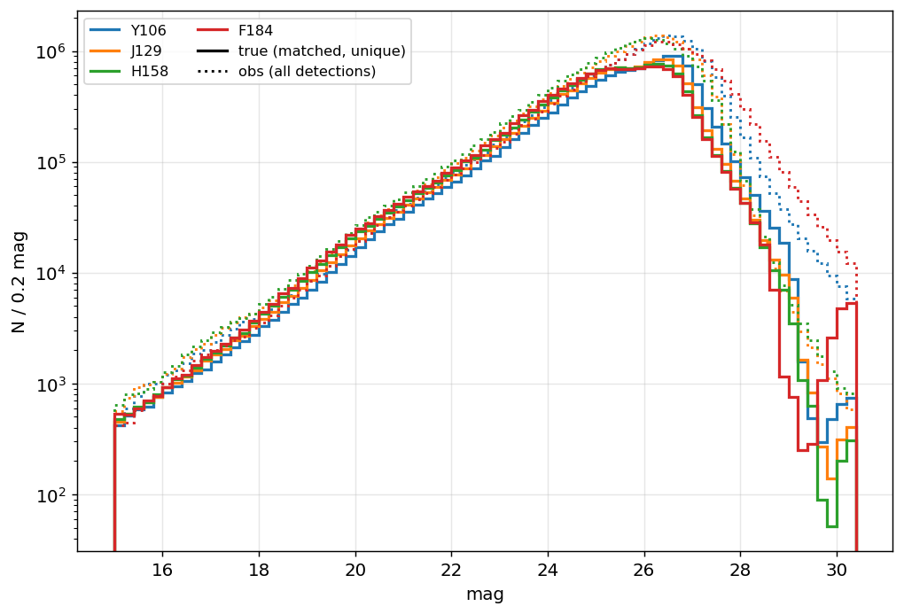
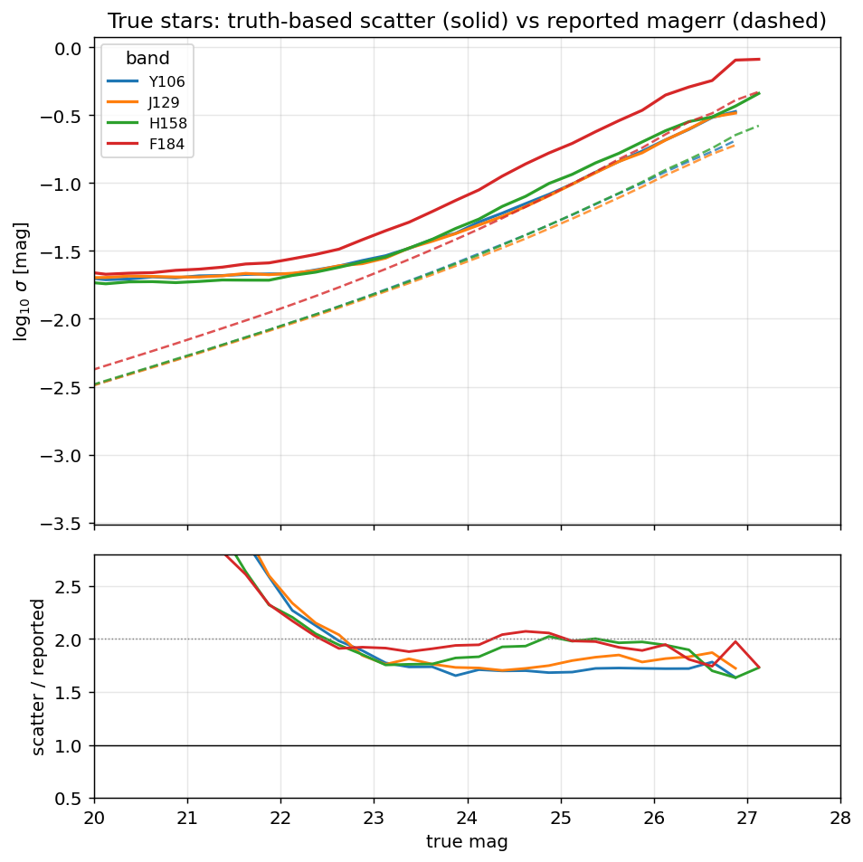
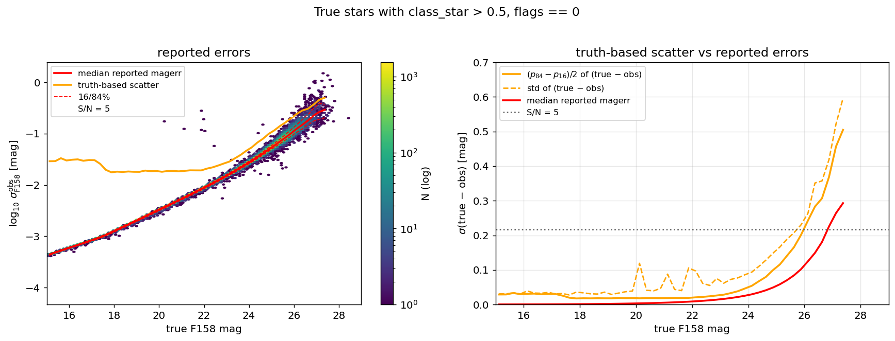
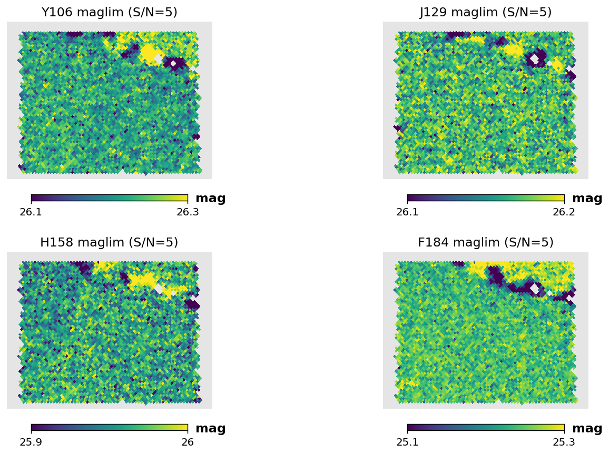
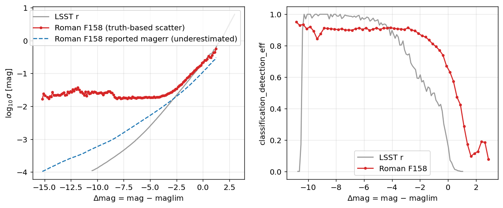

# Roman DC2 Survey Files

This page describes the construction of the Roman High Latitude Wide Area Survey
(HLWAS) selection function shipped with streamobs: the stellar
detection-and-classification completeness, the photometric error model, and the
magnitude-limit (depth) maps, together with the conventions that tie them together.

## The simulated survey

All quantities are measured from the Roman–Rubin DC2 synthetic survey of
[Troxel et al. (2023)](https://arxiv.org/abs/2209.06829): ~20 deg² of image-level
simulations of the Roman High Latitude Imaging Survey reference design at full
depth, reaching a 5σ point-source depth of ~26.9 AB in the F106/F129/F158 bands and
26.2 AB in F184. Stars are drawn from a Galfast model of the Galaxy and galaxies
from the cosmoDC2 extragalactic catalog. Object detection and photometry are
performed with SExtractor on a median F106+F129+F158+F184 coadd detection image
(segmentation at 2.5σ with a minimum area of 5 pixels; deblending with
`DEBLEND_NTHRESH=48`, `DEBLEND_MINCONT=0.05`), with forced photometry in each band,
over 1039 coadd tiles. The recommended catalog-level selection of S/N > 5 in the
detection image is applied on top of this — i.e. the detection limit is a two-stage
selection, not a single 5σ threshold. Each tile provides a
detection catalog and a truth index listing every simulated object in the tile with
its position, four-band magnitudes, and a star/galaxy label.

## Matched detection–truth catalog

We match every detection to a true source, following the recipe of Troxel et al.:
a detection is associated with the truth objects within 1″, and where several
qualify, with the closest in magnitude among the up to three nearest on the sky.
The magnitude comparison uses the detection's `mag_auto` (measured on the
median-combined detection image) against a truth broadband magnitude formed from
the mean flux across the four truth bands, which is the natural truth-side analog
of the detection image. The match is detection-centric: each detection is assigned
to its single dominant (typically brightest) true source, which keeps the
observed↔true magnitude relation clean in the presence of blending, at the cost of
assigning a blend to only one of its members.

Following the paper, three selections define the analysis sample:

1. **`flags == 0`** — objects with any SExtractor flag are removed (32% of
   detections, matching the fraction quoted in the paper). This is the selection an
   observer would apply to obtain a *pure stellar sample* from the data: the flag is
   the bitwise OR of the detection and per-band measurement flags, so the cut
   removes blended objects and contaminated photometry. It is deliberately stricter
   than parts of the paper's own analysis (which readmits flags 1–2), and it is the
   origin of the ~0.90 bright-end completeness plateau below;
2. **S/N > 5** in the detection image;
3. **a positional match to a true object**, as defined above.



*Number counts (color = band): solid — true magnitudes of matched sources; dotted —
observed `mag_auto` of all S/N>5 detections. The turnover at ~26–26.5 reflects the
survey depth.*

## Stellar completeness

The completeness table `roman_stellar_efficiency_cutf158.csv` gives, in bins of
true F158 magnitude for true stars:

- `detection_eff` — the fraction with a clean (`flags==0`) S/N>5 detection matched
  to them. The denominator is the full truth-star catalog, including undetected
  stars, so this is a true completeness;
- `classifiction_eff` — among detected stars, the fraction whose detection is
  classified as a point source, for which we adopt SExtractor `class_star > 0.5`
  (the median `class_star` of detected true stars is 0.94);
- `classification_detection_eff` — the product: the probability that a true star
  appears in the catalog *and* is classified as a star.

The bright plateau sits at ~0.90–0.95 rather than unity: stars blended with
brighter neighbours either share a detection assigned to the neighbour or carry
blend flags and are removed by the `flags==0` selection. This is a property of the
adopted catalog cuts, not of the instrument. The combined efficiency crosses 50% at
F158 ≈ 27.2 in the simulated (reference-depth) survey.

We characterize stellar contamination with the same machinery: for *true galaxies*
that are detected and compact — measured semi-major axis `awin_world < 0.3″`, the
truth catalog providing no intrinsic size — the fraction misclassified as stars is
below 1% brighter than F158 ≈ 25.5 and rises to ~15–17% at the faint end.


*Detection and classification efficiency for true stars, with the misclassification
rate of detected compact (<0.3″) true galaxies on the same axes.*

## Photometric errors

Because the truth is available, the reported photometric uncertainties can be
validated directly: for true stars, the scatter of observed-minus-true magnitude
should match the reported `magerr_auto`. It does not. The truth-based scatter —
measured as half the 16th-to-84th percentile span of (m_obs − m_true) in bins of
magnitude — exceeds the reported errors by a flat factor of ~1.9–2.0 at all
magnitudes and in all four bands, the signature of SExtractor underestimating the
correlated noise of the resampled, median-combined coadds.



*Truth-based scatter (solid) and median reported `magerr_auto` (dashed) for true
stars per band, with their ratio in the lower panel: a constant factor ≈2 in every
band.*

The photometric error model `roman_photoerror_f158.csv` is therefore built from the
**truth-based scatter**, not the reported errors: it tabulates the binned log10
scatter of (observed − true) F158 magnitude against `delta_mag = m_true − maglim`,
where the magnitude limit is evaluated at each object's position from the nside=1024
depth map described below. The sample is **true stars that pass the star
classification** — the population an injected stream star follows. (An
observationally star-classified sample would not do: it is galaxy-dominated
faintward of F158 ≈ 25.5, where misclassified compact galaxies roughly double the
apparent scatter.) Tabulating against `delta_mag` rather than magnitude makes the
model portable across regions (and surveys) of different depth, under the assumption
that the error profile depends on magnitude only through the local depth.



*Left: reported F158 `magerr_auto` against true F158 magnitude for star-classified
true stars, with the binned median and 16/84% curves of the reported errors and, in
orange, the truth-based scatter adopted for the error model. Right: the binned
scatter of (true − observed) — robust (p84−p16)/2 and plain standard deviation —
against the median reported error: the reported errors under-cover the real scatter
by a factor ≈2 everywhere.*

## Zeropoints and extinction coefficients

For reference, the official Roman WFI AB-magnitude zeropoints (effective-area curves
of 2024-03-01, from the
[Roman technical information repository](https://github.com/RomanSpaceTelescope/roman-technical-information/blob/main/roman_technical_information/data/WideFieldInstrument/Imaging/ZeroPoints/Roman_zeropoints_20240301.ecsv);
the range reflects detector-to-detector variation across WFI01–WFI18):

| Filter | AB zeropoint | mean |
|---|---|---|
| F106 | 26.31 – 26.44 | 26.36 |
| F129 | 26.30 – 26.47 | 26.37 |
| F158 | 26.34 – 26.46 | 26.39 |

These agree with the single-value zeropoints of Roman-STScI-000825 Table 3
(Z = 26.3546, 26.3531, 26.3760 with detector-to-detector σ_Z ≈ 0.033–0.038 for
F106/F129/F158).

The mock's photometry is calibrated greyly (a constant per-band offset from bright
stars, mimicking standard-star calibration); the measured offsets are +0.11/+0.10/+0.12
mag in F106/F129/F158. F184 additionally requires a chromatic (color-dependent)
correction that the simulation team did not derive, which is one reason F184 is
excluded from the survey configuration (it is also deep-tier-only in the
community-defined HLWAS).

The extinction coefficients adopted in the configuration are the official STScI
values from
[Roman-STScI-000825](https://www.stsci.edu/files/live/sites/www/files/home/roman/documentation/technical-documentation/_documents/Roman-STScI%E2%80%93000825.pdf)
(Sharma, Table 3), computed by integrating a solar-parameter Phoenix spectrum
through the WFI bandpasses with synphot (the change in apparent magnitude per unit
E(B−V); for the narrow Roman bands the dependence on stellar parameters is
negligible):

| Filter | A_band / E(B−V) |
|---|---|
| F106 | 1.1495 |
| F129 | 0.8497 |
| F158 | 0.6140 |

The *shape* of this law is independently validated against the simulation: the truth
catalog's per-band dereddening corrections have band ratios of 1.88 (F106/F158) and
1.37 (F129/F158), matching the official ratios (1.87, 1.38) to ~1%. (The absolute
amplitudes cannot be cross-checked from the mock — its dust application is known to
be incorrect, with Milky Way extinction absent from the Roman images — but the
absolute extinction in typical high-latitude fields is small in any case:
A_F158 ≈ 0.01 mag at E(B−V) = 0.013.)

## Survey depth

Depth maps are computed per band on a HEALPix nside=1024 grid (ring ordering) with
the method of [desqr](https://github.com/kadrlica/desqr/blob/main/desqr/depth.py):
after removing the bright end, the global slope of log10(magerr) versus magnitude
is estimated from nearest-neighbour pairs (the peak of a kernel density estimate of
the pairwise ratio); each object's magnitude is then extrapolated along that slope
to the magnitude at which it would reach the threshold signal-to-noise, and the
magnitude limit of a pixel is the median over its objects. We define depth at
**S/N = 5**, consistent with the catalog's detection threshold, and use the same
sample as the photometric error model (true stars passing the star classification),
so the maps and the error model describe one population.

Because the desqr extrapolation runs on the *reported* errors, which underestimate
the truth by a factor ≈2, the raw maps come out unphysically deep (medians
27.6–27.9). The spatial structure is unaffected by a global error factor, so we keep
it and **truth-anchor the absolute scale**: each band's map is shifted so that its
median equals the magnitude at which the truth-based scatter of (observed − true)
reaches S/N = 5. The anchored medians are **26.19 / 26.19 / 25.98 / 25.26** in
F106/F129/F158/F184. With this anchoring the photometric error model evaluates to
exactly σ = 0.217 (S/N = 5) at `delta_mag = 0` — "maglim" means S/N = 5 in the same
truth-based sense everywhere. These depths sit ~0.7–0.9 mag brighter than the
official expected point-source depths (26.9/26.2): the official values assume
optimal PSF photometry, while these describe what the catalog's `mag_auto`
photometry actually delivers in true-magnitude space.



*Truth-anchored S/N=5 magnitude-limit maps over the DC2 footprint (RA 51–56, Dec −42
to −38). The spatial structure traces the simulated dither/pass pattern.*

### Depth convention

The maps are released truth-anchored
(`roman_dc2_maglim_f*_nside1024.fits.gz`), and the `delta_mag` axes of the
completeness and photometric-error tables are keyed to the median of the F158 map
(25.98), so maps and tables share a single convention in which maglim is the
true-scatter S/N=5 depth. A magnitude-limit map for a different footprint (e.g. an
exposure-time-scaled map of the real HLWAS) must be expressed in this same
convention — scaled relative to the DC2 depth — for the tables to apply. For
reference, the
[STScI community-defined HLWAS median 5σ point-source depths](https://roman-docs.stsci.edu/roman-community-defined-surveys/high-latitude-wide-area-survey)
are:

| Tier | Area | 5σ point-source total depth (AB) |
|---|---|---|
| Wide | ~2700 deg² | F158 26.2 |
| Medium | ~2400 deg² | F106 26.5, F129 26.4, F158 26.4 |
| Deep | ~19.2 deg² | F106 27.7, F129 27.6, F158 27.5, F184 27.0, F213 25.9 |

Substituting a shallower (e.g. wide-tier) map translates the completeness and error
curves to the corresponding depths, under the assumption that the selection function
depends on magnitude only through `mag − maglim`.



*The Roman F158 photometric-error and combined-efficiency tables compared with the
LSST r-band tables in the shared `delta_mag = mag − maglim` convention.*

## Using the survey in streamobs

The survey is configured by `config/surveys/roman_hlwas.yaml`, with data files in
`data/surveys/roman_hlwas/`:

```python
from streamobs.surveys import SurveyFactory
survey = SurveyFactory.create_survey("roman", release="hlwas")

maglim = survey.get_maglim("f158", pixel=pix)
completeness = survey.get_completeness("f158", mag, maglim)
photo_error = survey.get_photo_error("f158", mag, maglim)
```

All tables, maps, and the figures on this page are regenerated by
`scripts/roman/create_streamobs_files_hlwas.py` (the matched catalog itself by
`scripts/roman/build_roman_dc2_det_truth.py`).

## Caveats

- The simulation is the *reference* HLIS design (deeper than the current
  community-defined wide tier); wide-tier behaviour is obtained by translation in
  `delta_mag`, not by an independent simulation.
- The detection-centric match assigns a blend to its dominant source, so the
  detection efficiency is slightly conservative for stars blended with brighter
  neighbours.
- Saturation is modeled in the simulation (pixels clip at ~1.1×10⁵ e⁻) and its
  effects appear brighter than mag ≈ 17 — the dip in the classification efficiency
  near mag 16.6 is its signature — and stars brighter than 15 are not chromatically
  rendered. The configuration therefore sets `saturation: 17.0`; photometry of
  brighter stars should not be trusted.
- `mag_auto` carries a systematic offset with respect to the truth (≈ +0.1–0.2 mag
  in F106/F129/F158 and ≈ +0.6 mag in F184 at the bright end, growing toward faint
  magnitudes from aperture losses). The error model captures the scatter about this
  offset, not the offset itself.
- The detection catalogs are detector-optimistic: the coadds use the "simple"
  detector model (read noise, dark current, saturation only — no cosmic rays,
  persistence, interpixel capacitance, or hot pixels) and bright stars are not
  masked (12 diffraction spikes remain in the images).
