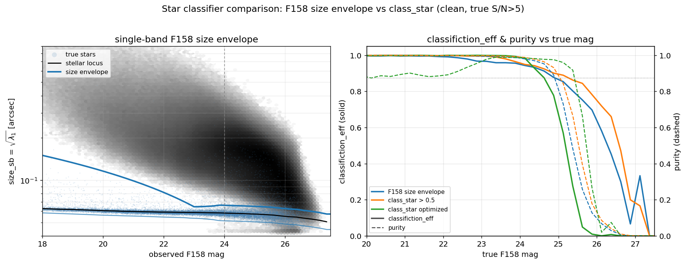

# Roman DC2 Survey Files

This page is the **data sheet** for the `roman / dc2` release: the survey-specific
numbers, products, and figures. For **how** these products are derived (the matched
detection→truth catalog, the size-envelope classifier, the two-curve photo-error
model + afterburner, the truth-anchored depth maps, the analysis selections), see the
survey-agnostic :doc:`selection_function_methodology`.

## The simulated survey

All quantities are measured from the Roman–Rubin DC2 synthetic survey of
[Troxel et al. (2023)](https://arxiv.org/abs/2209.06829): ~20 deg² of image-level
simulations of the Roman High Latitude Imaging Survey reference design at full depth,
reaching a 5σ point-source depth of ~26.9 AB in the F106/F129/F158 bands and 26.2 AB
in F184. Stars are drawn from a Galfast model of the Galaxy and galaxies from the
cosmoDC2 extragalactic catalog. Object detection and photometry are performed with
SExtractor on a median F106+F129+F158+F184 coadd detection image (segmentation at
2.5σ, minimum area 5 pixels; deblending `DEBLEND_NTHRESH=48`,
`DEBLEND_MINCONT=0.05`), with forced photometry per band over 1039 coadd tiles. The
recommended catalog-level selection of S/N > 5 in the detection image is applied on
top of this. Each tile provides a detection catalog and a truth index of every
simulated object with its position, four-band magnitudes, and a star/galaxy label.

The matched detection→truth catalog is built by
`scripts/roman/build_roman_dc2_det_truth.py`; its construction (the per-tile 1″
positional match, the `flags == 0` + true-S/N>5 selections) is described in the
:doc:`selection_function_methodology`. The measured **F158 error inflation factor**
is 1.59, so the true-S/N>5 cut is set at reported `magerr_auto_H158` < 0.137,
keeping 69% of the catalog.


*Number counts (color = band): solid — true magnitudes of matched sources; dotted —
observed `mag_auto` of all S/N>5 detections. The turnover at ~26–26.5 reflects the
survey depth.*

## Stellar completeness and classification

`roman_stellar_efficiency_cutf158.csv` gives, in bins of true F158 magnitude for true
stars: `detection_eff` (fraction with a clean true-S/N>5-in-F158 detection, against
the full truth-star denominator), `classifiction_eff` (fraction of those detected
stars classified as point sources by the F158 size envelope), and
`classification_detection_eff` (their product). The classifier and the misspelled
`classifiction_eff` header are explained in the methodology page.



*Left: the single-band F158 size–magnitude plane (greyscale: true galaxies; blue:
true stars) with the size-envelope boundaries and the freeze magnitude marked. Right:
classification efficiency (solid) and purity (dashed) vs true F158 magnitude for the
F158 size envelope, the fixed `class_star > 0.5` cut, and a per-magnitude-optimized
`class_star` threshold, on the clean true-S/N>5 sample.*

The bright plateau sits at ~0.91 (not unity) and is flat with magnitude — the
signature of the `flags == 0` cut, not depth: of the ~9% of bright (F158 18–21) true
stars missing, ~7% are matched but flag-rejected (blends/wings/saturation) and ~3%
have no clean detection because the detection-centric match assigned their blend to a
brighter source. Detection alone crosses 50% at F158 ≈ 26.2 (≈ the F158 maglim 26.38,
as expected for an F158 S/N=5 gate); the combined efficiency crosses 50% at F158 ≈
26.0 at reference depth.


*Detection and classification efficiency for true stars, with the misclassification
rate of detected compact (<0.3″) true galaxies on the same axes (below 1% brighter
than F158 ≈ 25.5, rising to ~5% toward the faint end).*

The standalone galaxy-misclassification product (`roman_galaxy_misclass_cutf158.csv`,
columns `delta_mag, mag_F158, classifiction_eff`) and the merged LSST↔Roman table
(`roman_lsst_matched.parquet`) are built by
`scripts/roman/build_roman_galaxy_misclass.py`. The compact-galaxy size currently
uses the interim measured-Roman proxy (`SIZE_SOURCE=measured_roman`); the cosmoDC2
true-size upgrade is wired but pending the NERSC `size_true` fetch.

## Photometric errors

The reported `magerr_auto` underestimates the truth-based scatter of (obs − true) by
a flat factor ≈2 in all four bands (underestimated correlated coadd noise), so the
error model is built from the truth-based scatter — see the methodology page.


*Truth-based scatter (solid) vs median reported `magerr_auto` (dashed) for true stars
per band; ratio ≈2 in every band (lower panel).*


*F158 errors for star-classified true stars: reported `magerr_auto` (red), the
truth-based scatter adopted for the model (orange), and the (true − obs) scatter
under-covered by the reported errors by ≈2 (right).*

The two runtime curves are `roman_photoerror_f158.csv` (sample / truth-based scatter,
drives the noise draw) and `roman_photoerror_f158_catalog.csv` (median reported
magerr, drives the S/N cut). The afterburner corrections live in the tracked
`config/surveys/roman_photoerror_corrections.yaml`:

- **F158_sample** (`clamp_faint`): floor `log_mag_err` to −0.8285 for
  `delta_mag ≥ −0.28` (holds the truth-scatter at its last well-sampled value,
  σ ≈ 0.148, rather than propagating small-sample noise).
- **F158_catalog** (`clamp_faint`): floor `log_mag_err` to −0.8960 for
  `delta_mag ≥ 0.0` (removes a 0.003-dex reversal in the last bin).

## Survey depth

Depth maps are per-band, nside=1024 (ring), via the desqr recipe, then
**truth-anchored** (median shifted to the S/N=5 magnitude of the truth-based
scatter). The anchored medians are **26.28 / 26.38 / 26.38 / 25.35** in
F106/F129/F158/F184. These sit ~0.5–0.85 mag brighter than the official expected
point-source depths (26.9/26.2) because they describe what the catalog's `mag_auto`
delivers in true-magnitude space, not optimal-PSF photometry.


*Truth-anchored S/N=5 maglim maps over the DC2 footprint (RA 51–56, Dec −42 to −38).*

The `delta_mag` axes of the completeness and photo-error tables are keyed to the
median of the F158 map (26.38), so maps and tables share one convention. A map for a
different footprint (e.g. the exposure-scaled HLWAS tiers, :doc:`roman_hlwas`) must be
expressed in this same DC2-relative convention.


*Roman F158 photo-error and combined-efficiency tables vs the LSST r-band tables in
the shared `delta_mag = mag − maglim` convention.*

## Zeropoints and extinction coefficients

Official Roman WFI AB zeropoints (effective-area curves of 2024-03-01, from the
[Roman technical information repository](https://github.com/RomanSpaceTelescope/roman-technical-information/blob/main/roman_technical_information/data/WideFieldInstrument/Imaging/ZeroPoints/Roman_zeropoints_20240301.ecsv);
range = detector-to-detector variation WFI01–WFI18):

| Filter | AB zeropoint | mean |
|---|---|---|
| F106 | 26.31 – 26.44 | 26.36 |
| F129 | 26.30 – 26.47 | 26.37 |
| F158 | 26.34 – 26.46 | 26.39 |

These agree with Roman-STScI-000825 Table 3 (Z = 26.3546/26.3531/26.3760,
σ_Z ≈ 0.033–0.038). The mock's photometry is calibrated greyly; measured offsets are
+0.11/+0.10/+0.12 mag in F106/F129/F158. F184 needs an underived chromatic correction
and is excluded (it is also deep-tier-only in the community-defined HLWAS).

Adopted extinction coefficients are the official STScI values from
[Roman-STScI-000825](https://www.stsci.edu/files/live/sites/www/files/home/roman/documentation/technical-documentation/_documents/Roman-STScI%E2%80%93000825.pdf)
(Sharma, Table 3):

| Filter | A_band / E(B−V) |
|---|---|
| F106 | 1.1495 |
| F129 | 0.8497 |
| F158 | 0.6140 |

The *shape* is validated against the mock: the truth dereddening band ratios 1.88
(F106/F158) and 1.37 (F129/F158) match the official ratios (1.87, 1.38) to ~1%.
(Absolute amplitudes can't be cross-checked — the mock omits MW extinction — but
A_F158 ≈ 0.01 mag at E(B−V) = 0.013 in typical high-latitude fields.)

## Using the survey in streamobs

Configured by `config/surveys/roman_dc2.yaml`, data in `data/surveys/roman_dc2/`:

```python
from streamobs.surveys import SurveyFactory
survey = SurveyFactory.create_survey("roman", release="dc2")

maglim = survey.get_maglim("F158", pixel=pix)
completeness = survey.get_completeness("F158", mag, maglim)
photo_error = survey.get_photo_error("F158", mag, maglim)
```

All tables, maps, and figures are regenerated by
`scripts/roman/create_streamobs_files_hlwas.py` (the matched catalog by
`scripts/roman/build_roman_dc2_det_truth.py`; the galaxy-misclassification product by
`scripts/roman/build_roman_galaxy_misclass.py`; the shared classifier in
`scripts/roman/roman_star_classifier.py`).

The real-footprint HLWAS tiers reuse these DC2-derived tables with exposure-scaled
F158 maglim maps — see :doc:`roman_hlwas`.

## Caveats

- The simulation is the *reference* HLIS design (deeper than the community-defined
  wide tier); wide-tier behaviour is obtained by translation in `delta_mag`.
- The detection-centric match assigns a blend to its dominant source, so detection
  efficiency is slightly conservative for stars blended with brighter neighbours.
- Saturation (pixels clip at ~1.1×10⁵ e⁻) appears brighter than mag ≈ 17 (the
  classification dip near 16.6 is its signature); stars brighter than 15 are not
  chromatically rendered. The config sets `saturation: 17.0`.
- `mag_auto` carries a systematic offset vs truth (≈ +0.1–0.2 in F106/F129/F158,
  ≈ +0.6 in F184 at the bright end). The error model captures the scatter about this
  offset, not the offset itself.
- The detection catalogs are detector-optimistic (the "simple" detector model — read
  noise, dark current, saturation only; no cosmic rays, persistence, IPC, hot pixels;
  bright stars unmasked).
