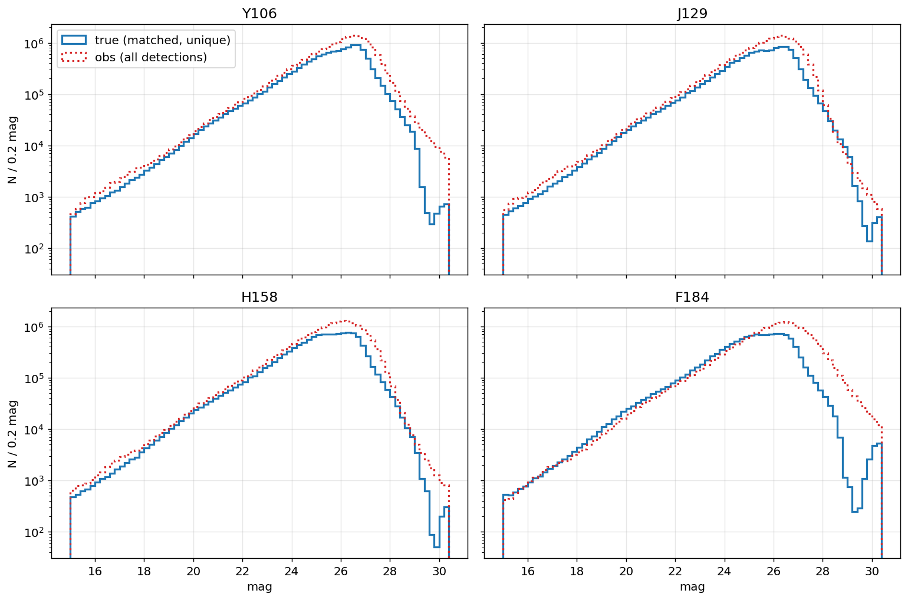
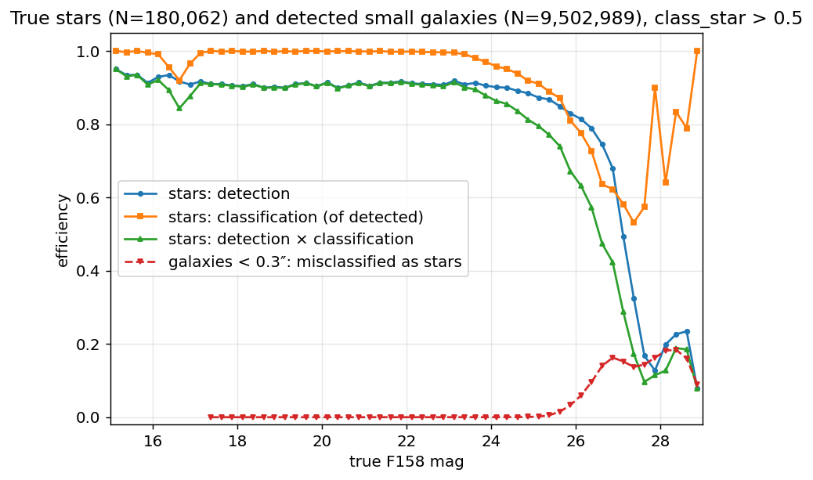
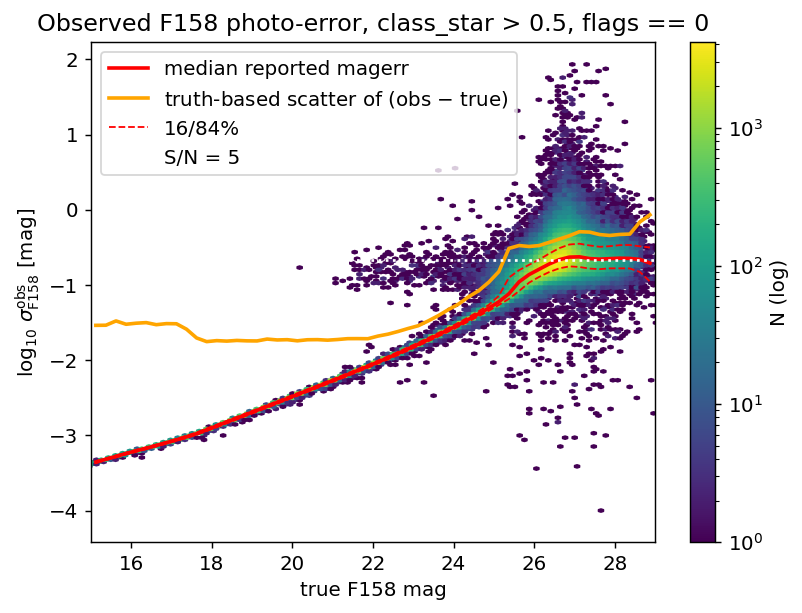
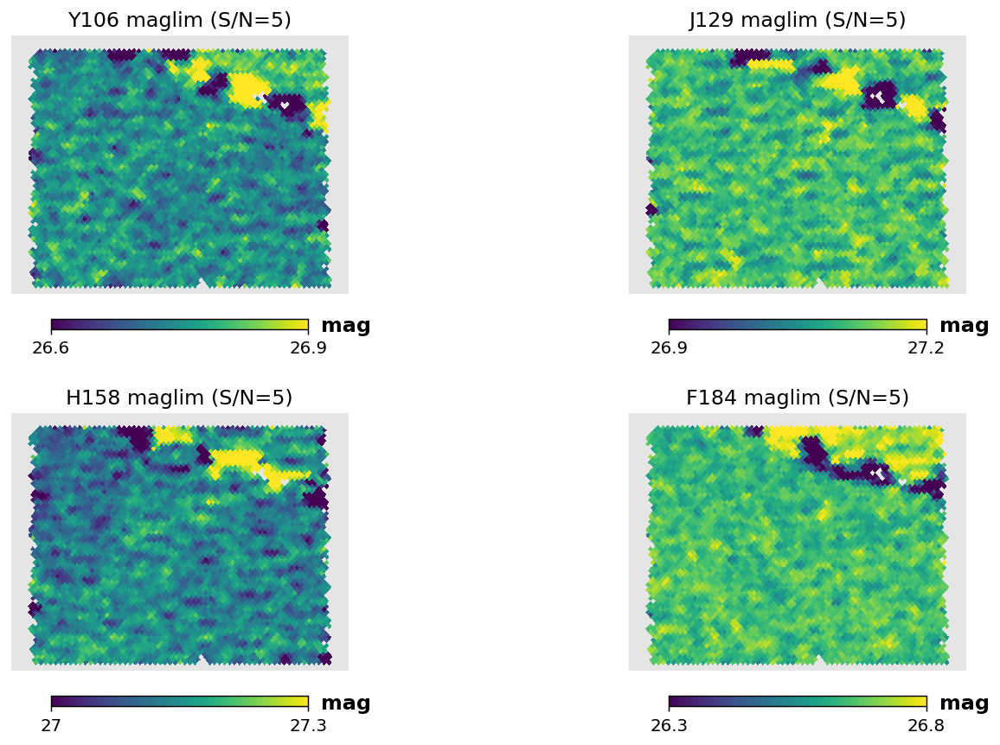
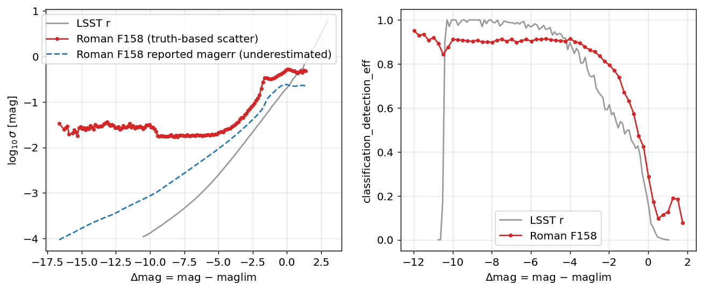

# Roman HLWAS Survey Files

This page describes the construction of the Roman High Latitude Wide Area Survey
(HLWAS) selection function shipped with streamobs: the stellar
detection-and-classification completeness, the photometric error model, and the
magnitude-limit (depth) maps, together with the conventions that tie them together.

## The simulated survey

All quantities are measured from the Roman–Rubin DC2 synthetic survey of
[Troxel et al. (2023)](https://arxiv.org/abs/2209.06829): ~20 deg² of image-level
simulations of the Roman High Latitude Imaging Survey reference design at full
depth, reaching a 5σ point-source depth of ~26.9 AB in the F106/F129/F158 bands and
26.2 AB in F184. Stars are drawn from a Galfast model of the Galaxy and galaxies
from the cosmoDC2 extragalactic catalog. Object detection and photometry are
performed with SExtractor on a median F106+F129+F158+F184 coadd detection image,
with forced photometry in each band, over 1039 coadd tiles. Each tile provides a
detection catalog and a truth index listing every simulated object in the tile with
its position, four-band magnitudes, and a star/galaxy label.

## Matched detection–truth catalog

We match every detection to a true source, following the recipe of Troxel et al.:
a detection is associated with the truth objects within 1″, and where several
qualify, with the closest in magnitude among the up to three nearest on the sky.
The magnitude comparison uses the detection's `mag_auto` (measured on the
median-combined detection image) against a truth broadband magnitude formed from
the mean flux across the four truth bands, which is the natural truth-side analog
of the detection image. The match is detection-centric: each detection is assigned
to its single dominant (typically brightest) true source, which keeps the
observed↔true magnitude relation clean in the presence of blending, at the cost of
assigning a blend to only one of its members.

Following the paper, three selections define the analysis sample:

1. **`flags == 0`** — objects with any SExtractor flag are removed (32% of
   detections, matching the fraction quoted in the paper);
2. **S/N > 5** in the detection image;
3. **a positional match to a true object**, as defined above.

A further property of the truth catalog requires care: about a quarter of the true
stars carry a second truth entry at the same position under a different identifier,
populated in only one band. Because the matcher can assign a star's detection to
either entry, we collapse the truth catalog to unique positions (209,024 entries →
181,502 stars) and count a star as detected if *any* of its entries received a
match. Without this, the detection efficiency would show a spurious, flat ~12%
deficit at all magnitudes.



*Number counts per band: solid — true magnitudes of matched sources; dotted —
observed `mag_auto` of all S/N>5 detections. The turnover at ~26–26.5 reflects the
survey depth.*

## Stellar completeness

The completeness table `roman_stellar_efficiency_cutf158.csv` gives, in bins of
true F158 magnitude for true stars:

- `detection_eff` — the fraction with a clean (`flags==0`) S/N>5 detection matched
  to them. The denominator is the full truth-star catalog, including undetected
  stars, so this is a true completeness;
- `classifiction_eff` — among detected stars, the fraction whose detection is
  classified as a point source, for which we adopt SExtractor `class_star > 0.5`
  (the median `class_star` of detected true stars is 0.94);
- `classification_detection_eff` — the product: the probability that a true star
  appears in the catalog *and* is classified as a star.

The bright plateau sits at ~0.90–0.95 rather than unity: stars blended with
brighter neighbours either share a detection assigned to the neighbour or carry
blend flags and are removed by the `flags==0` selection. This is a property of the
adopted catalog cuts, not of the instrument. The combined efficiency crosses 50% at
F158 ≈ 27.2 in the simulated (reference-depth) survey.

We characterize stellar contamination with the same machinery: for *true galaxies*
that are detected and compact — measured semi-major axis `awin_world < 0.3″`, the
truth catalog providing no intrinsic size — the fraction misclassified as stars is
below 1% brighter than F158 ≈ 25.5 and rises to ~15–17% at the faint end.



*Detection and classification efficiency for true stars, with the misclassification
rate of detected compact (<0.3″) true galaxies on the same axes.*

## Photometric errors

The photometric error model `roman_photoerror_f158.csv` is the binned median of
log10 of the observed F158 `magerr_auto` for star-classified objects, tabulated
against `delta_mag = m_true − maglim`, where the magnitude limit is evaluated at
each object's position from the nside=1024 depth map described below. Tabulating
against `delta_mag` rather than magnitude makes the model portable across regions
(and surveys) of different depth, under the assumption that the error profile
depends on magnitude only through the local depth.



*Observed F158 `magerr_auto` against true F158 magnitude for star-classified
objects, with binned median and 16/84% curves. The error saturates near the S/N≈5
floor at the faint end; the sparse cloud above the median relation is blends.*

## Survey depth

Depth maps are computed per band on a HEALPix nside=1024 grid (ring ordering) with
the method of [desqr](https://github.com/kadrlica/desqr/blob/main/desqr/depth.py):
after removing the bright end, the global slope of log10(magerr) versus magnitude
is estimated from nearest-neighbour pairs (the peak of a kernel density estimate of
the pairwise ratio); each object's magnitude is then extrapolated along that slope
to the magnitude at which it would reach the threshold signal-to-noise, and the
magnitude limit of a pixel is the median over its objects. We define depth at
**S/N = 5**, consistent with the catalog's detection threshold. The resulting
medians are 26.77/27.11/27.11/26.67 in F106/F129/F158/F184.

These measured depths run ~0.2 mag (F106–F158) to ~0.5 mag (F184) past the official
expected 5σ point-source depths of the simulated survey. The same excess is visible
in Figure 5 of Troxel et al., whose measured magnitude histograms extend beyond the
expected limiting-magnitude lines (most prominently in F184); the likely cause is
that SExtractor underestimates the correlated noise of the resampled, median-combined
coadds, inflating the apparent signal-to-noise.



*Measured S/N=5 magnitude-limit maps over the DC2 footprint (RA 51–56, Dec −42 to
−38). The spatial structure traces the simulated dither/pass pattern.*

### Depth convention and normalization

Because of this offset, we adopt the **official 5σ point-source depth** as the
reference convention. Each band's map is provided in two forms:

- the raw measured map (`roman_dc2_maglim_f*_nside1024.fits.gz`);
- a normalized map (`..._5sigps.fits.gz`) shifted so its median equals the official
  depth of the simulated survey (26.9 in F106/F129/F158, 26.2 in F184), preserving
  the measured spatial structure.

The `delta_mag` axes of the completeness and photometric-error tables are keyed to
the official convention, so they must be paired with magnitude-limit maps in the
same convention — the `_5sigps` maps above or, for the real HLWAS footprint, an
exposure-time-scaled map normalized to the
[STScI community-defined HLWAS median 5σ point-source depths](https://roman-docs.stsci.edu/roman-community-defined-surveys/high-latitude-wide-area-survey):

| Tier | Area | 5σ point-source total depth (AB) |
|---|---|---|
| Wide | ~2700 deg² | F158 26.2 |
| Medium | ~2400 deg² | F106 26.5, F129 26.4, F158 26.4 |
| Deep | ~19.2 deg² | F106 27.7, F129 27.6, F158 27.5, F184 27.0, F213 25.9 |

With this convention, substituting a shallower (e.g. wide-tier) map automatically
translates the completeness and error curves to the correct depths, under the
assumption that the selection function depends on magnitude only through
`mag − maglim`.



*The Roman F158 photometric-error and combined-efficiency tables compared with the
LSST r-band tables in the shared `delta_mag = mag − maglim` convention.*

## Using the survey in streamobs

The survey is configured by `config/surveys/roman_hlwas.yaml`, with data files in
`data/surveys/roman_hlwas/`:

```python
from streamobs.surveys import SurveyFactory
survey = SurveyFactory.create_survey("roman", release="hlwas")

maglim = survey.get_maglim("f158", pixel=pix)
completeness = survey.get_completeness("f158", mag, maglim)
photo_error = survey.get_photo_error("f158", mag, maglim)
```

## Caveats

- The simulation is the *reference* HLIS design (deeper than the current
  community-defined wide tier); wide-tier behaviour is obtained by translation in
  `delta_mag`, not by an independent simulation.
- The detection-centric match assigns a blend to its dominant source, so the
  detection efficiency is slightly conservative for stars blended with brighter
  neighbours.
- The truth catalog only extends to ~15 AB and the simulation does not model
  saturation; the configured `saturation: 15.0` marks the validity limit of the
  completeness table rather than the physical WFI saturation (~17–18 AB for point
  sources).
- Extinction coefficients are CCM89 (R_V = 3.1) evaluated at the filter effective
  wavelengths (1.14, 0.83, 0.60, 0.47 for F106/F129/F158/F184).
