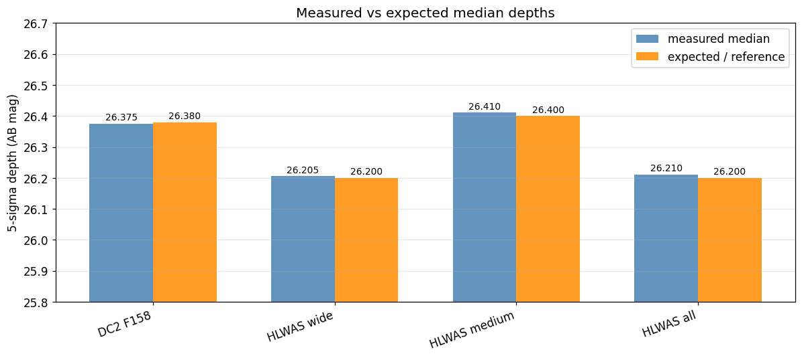
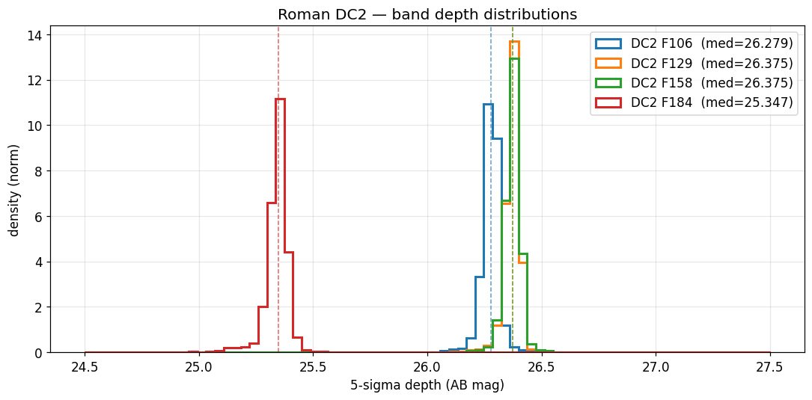

# Selection-Function Derivation Methodology

This technote documents **how** the streamobs survey selection-function products are
derived from an image-level survey simulation: the stellar
detection-and-classification completeness, the galaxy misclassification rate, the
photometric-error model, and the magnitude-limit (depth) maps, together with the
conventions that tie them together.

It is written **survey-agnostically**. The products it describes were first derived
for Roman from the Roman–Rubin DC2 mock (see :doc:`roman_dc2`), and the same recipe
is intended to be re-applied to re-derive the LSST and DES products
self-consistently. Per-survey numbers (depths, bands, extinction coefficients,
saturation) live on the per-release data pages; the method lives here.

## What streamobs needs

For each survey/release, the injector consumes a small set of tabulated products,
all keyed to a single internal depth convention so they can be applied at any sky
position and translated between footprints of different depth:

| Product | File pattern | Drives |
|---|---|---|
| Stellar completeness vs `delta_mag` | `*_stellar_efficiency_cut<band>.csv` | detection + classification probability |
| Photo-error (sample) vs `delta_mag` | `*_photoerror_<band>.csv` | the magnitude noise **draw** |
| Photo-error (catalog) vs `delta_mag` | `*_photoerror_<band>_catalog.csv` | the reported error / **S/N cut** |
| Magnitude-limit (depth) maps | `*_maglim_<band>_nside<N>.fits.gz` | the local depth at each pixel |
| Galaxy misclassification vs `delta_mag` | `*_galaxy_misclass_cut<band>.csv` | stellar contamination (derived; future-consumed) |

The unifying variable is

```
delta_mag = mag_true − maglim(pixel)
```

i.e. magnitude **relative to the local 5σ depth**. Tabulating against `delta_mag`
rather than absolute magnitude makes every curve portable across regions (and
surveys) of different depth, under the single assumption that the selection function
depends on magnitude only through the local depth. Maps and tables are released in
**one** convention (see *Depth maps* below); substituting a shallower or deeper map
translates the curves to the corresponding depth.

> **Header spelling note.** The completeness CSV column is named `classification_eff`.
> The loader also accepts the legacy misspelled `classifiction_eff` column name for
> older/Zenodo data packages that pre-date this correction.

> **Column namespacing.** True-magnitude columns use the survey *name* only
> (`roman_F158_true`; true mags are release-independent), while observed/error/flag
> columns use the full `{name}_{release}` namespace
> (`roman_dc2_F158_obs`, `roman_dc2_flag_observed`), so multiple releases can coexist
> in one catalog.

## The matched detection→truth catalog

Every product below starts from a **matched detection→truth catalog**: one row per
catalog detection, carrying the truth payload (true magnitudes, the star/galaxy
label, the truth ID) for the true object it was matched to. The truth side is what
makes the products *validated* rather than merely *measured* — see *Validation &
audits*.

The matching recipe (following the source simulation's own prescription, e.g.
Troxel et al. 2023 for Roman):

1. **Detect + photometer** on the simulation's detection image (for Roman, a
   multi-band median coadd), producing a per-tile detection catalog with positions,
   `mag_auto`/`magerr_auto` per band, shape moments, flags, and a scalar
   star/galaxy score.
2. **Positionally match** each detection to truth objects within a fixed radius
   (1″); where several qualify, take the closest in magnitude among the nearest few
   — a detection-centric match that assigns a blend to its single dominant source,
   keeping the observed↔true magnitude relation clean at the cost of under-counting
   blend members.
3. **Tag** the analysis selections used downstream (see next).

This per-tile positional join is the tractable, parallelizable core; the heavy
single-epoch index files are **not** needed for catalog-level selection functions.
For the practical Roman recipe (file formats, tile layout, schema), see the
[combine plan archived in `artifacts/roman_hlwas/roman_dc2_combine_plan.md`].

### Analysis selections

Three selections define the sample the products are measured on:

1. **`flags == 0`** — drop any detection carrying a SExtractor flag (blends, edges,
   saturation, contaminated photometry). This is the cut an observer applies to
   obtain a *pure* sample; it is the origin of the bright-end completeness plateau
   below unity (a fixed fraction of bright stars are flagged because they are
   blended with a neighbour), which is a property of the adopted cut, not the
   instrument.
2. **true S/N > 5** in the reference band. Detection is treated as single-band: a
   source is "detected" when its forced reference-band photometry reaches a *true*
   S/N > 5. Because reported errors can underestimate the real noise (see *Photo
   errors*), the threshold on the reported error is set using a truth-measured error
   inflation factor rather than the nominal `magerr = 2.5/ln10/5 ≈ 0.2171`.
3. **a positional match to a true object.**

> **The S/N > 5 cut is owned by the efficiency curves.** It is baked into the
> selection-function products at derivation time. The injector must **not**
> re-apply a reference-band S/N cut on top of them — doing so would double-count the
> detection probability.

## Star classification: the single-band size envelope

Rather than a scalar `class_star`/`extendedness` threshold, stars are classified
with a single-band **size envelope**. A detection is a star iff

```
lower(mag) < size_sb < upper(mag)
```

where `size_sb = √λ₁ · 3600″` is the windowed semi-major axis (larger eigenvalue of
the per-band windowed second-moment matrix). The single-band second moments are used
because detection runs on a *combined* image, so the combined-depth `awin_world` /
`class_star` are not single-band quantities — and a single-band morphology is what an
injected single-band stream star can be tested against.

Working in `L = log10(size)`, the band is **symmetric** about the per-magnitude
stellar locus `L0(mag)` with half-width `Δ(mag)` (dex). `Δ(mag)` is tuned per
magnitude bin to a fixed **purity target** (0.875, the DES Y6 `0≤EXT_XGB≤1`
"complete" stellar operating point of
[Bechtol et al. 2025](https://arxiv.org/abs/2501.05739)), capped at the bright end
by the stellar log-size scatter (`N_SIG · σ_L`), forced single-peaked, PCHIP-splined,
and **frozen faintward of a freeze magnitude** at a fixed log offset — so the
selection stays as complete as possible past the magnitude where size no longer
separates stars from galaxies, rather than tightening into the noise. The upper
boundary additionally **flares toward bright magnitudes** to retain bright,
slightly-resolved stars whose measured size scatters above the locus.

The envelope reaches the same purity/completeness as a per-magnitude-optimized
scalar threshold while needing only the single reference band, and clearly beats a
fixed scalar cut whose purity falls away at the faint end.

> **One source of truth.** The classifier is implemented once, in
> `scripts/roman/roman_star_classifier.py` (`build_env_classifier`), and imported by
> both the selection-function generator and the galaxy-misclassification builder, so
> the two cannot drift. Re-deriving for another survey means re-fitting this same
> envelope on that survey's matched catalog.

### Galaxy misclassification

Stellar contamination is characterized with the *same* classifier: among **true
galaxies** that are detected and **compact** (size below a fixed threshold, default
0.3″), the fraction misclassified as stars, in bins of `delta_mag`. The compact-size
input is a single swappable knob (`SIZE_SOURCE`): the interim proxy is the measured
reference-band size; the upgrade is a true galaxy size joined from the parent
extragalactic catalog (for Roman/DC2, cosmoDC2 `size_true` by `cosmodc2_id` — see the
hook in `build_roman_galaxy_misclass.py`). The builder also saves a **merged
LSST↔Roman table** (truth + observed columns from both surveys, namespaced by
origin) for downstream background-distribution and matched-filter work. The
misclassification curve is a derived product; the injector does not yet consume it
(a future PR will add background distributions + matched-filter maps).


*Example (Roman DC2): true-star detection and classification efficiency with the
misclassification rate of detected compact (<0.3″) true galaxies on the same axes —
below 1% brighter than F158 ≈ 25.5, rising to ~5% toward the faint end.*

## Photometric errors

Because the truth is available, the reported photometric uncertainties are
**validated directly**: for true stars, the scatter of (observed − true) magnitude
should match the reported `magerr`. When it does not — for the Roman DC2 mock the
truth-based scatter runs a flat factor ≈2 above the reported errors in every band,
the signature of underestimated correlated noise in resampled median coadds — the
error *model* is built from the **truth-based scatter**, not the reported errors.

streamobs uses a **two-curve** error model (`Survey.get_photo_error`):

- **sample** curve (`*_photoerror_<band>.csv`) — the truth-based scatter of
  (obs − true); drives the **noise draw** applied to injected magnitudes.
- **catalog** curve (`*_photoerror_<band>_catalog.csv`) — the median reported
  error; written as the catalog `magerr` and used for the **S/N cut**.

Both tabulate `log10 σ` against `delta_mag`. The sample population is **true stars
that pass the star classification** — the population an injected stream star follows.
(An observationally star-classified sample would be galaxy-dominated at the faint end
and inflate the apparent scatter.)

### Afterburner (manual cleanup, saved)

Binned statistics carry small-sample scatter in the last few faint bins (reversals,
spikes) that should not propagate into the runtime curves. The generator therefore
applies a lightweight **afterburner**:

1. **Raw curves** (`*_raw.csv`) — unmodified binned outputs — are written every run
   as a provenance record.
2. **Corrections** are loaded from a *tracked* YAML
   (`config/surveys/roman_photoerror_corrections.yaml`) so every manual edit is
   attributed and reversible. The implemented rule, `clamp_faint`, floors
   `log_mag_err` to a fixed value for all bins at/beyond a chosen `delta_mag_min`
   (e.g. holding the faint-end noise at its last well-sampled value instead of
   letting it wobble).
3. **Cleaned curves** (the runtime filenames the config points at) — raw with
   corrections applied.

To adjust the cleanup, edit the YAML and re-run; the raw files preserve the
underlying measurement.

## Depth maps

Per-band magnitude-limit maps are computed on a HEALPix grid (nside=1024, ring) with
the [desqr](https://github.com/kadrlica/desqr/blob/main/desqr/depth.py) recipe:

1. cut the bright end and `mag < 30`;
2. estimate the global slope of `log10(magerr)` vs mag from nearest-neighbour pairs
   (KDE peak of the pairwise ratio);
3. per object, extrapolate to the magnitude where it would reach the threshold S/N
   (`magerr = 2.5/ln10/snr`);
4. take the **median per pixel**;
5. **truth-anchor the absolute scale**: because the desqr extrapolation runs on the
   reported errors (which can be too small), each band's map is shifted so its median
   equals the magnitude where the **truth-based scatter** reaches S/N = 5. The desqr
   machinery supplies the (error-factor-immune) *spatial structure*; the truth
   supplies the *absolute depth*. With this anchoring the photo-error model evaluates
   to σ = 0.217 (S/N = 5) at `delta_mag = 0` by construction — "maglim" means S/N = 5
   in the same truth-based sense everywhere.

The depth sample is the **same** true-star-passing-classification population as the
photo-error model, so the maps and the error model describe one population.

### Exposure-scaled quasi-depth (Option B)

When a survey footprint has no full image simulation but does have an
**exposure-time map** (e.g. the real Roman HLWAS tiers), depth is obtained by scaling
the truth-anchored reference depth by photon-noise √t S/N:

```
depth(pix) = REF_DEPTH + 1.25 · log10( t(pix) / REF_EXPTIME )
```

where `REF_DEPTH` is the median of the truth-anchored reference maglim map and
`REF_EXPTIME` is the reference simulation's per-pixel exposure time. The 1.25 factor
is `2.5 × 0.5`, the limiting-magnitude response to √t. This **Option B** anchors all
tiers to the *same* truth-anchored reference (not to per-tier ETC depths of mixed
vintage), so the maps land exactly on the depth scale the `delta_mag`-keyed tables
require, and inter-tier comparisons are self-consistent. It assumes background-limited
exposures (read-noise makes the shortest exposures slightly shallower than predicted).

## Validation & audits

### Already validated (this PR)

- **Truth-based photo-error validation.** The reported errors are checked against the
  scatter of (obs − true) for true stars per band; the constant ≈2 discrepancy in the
  Roman DC2 mock is *why* the error model and depth maps are truth-anchored rather
  than taken at face value. Figure: `error_validation.png` on :doc:`roman_dc2`.
- **Depth-map validation notebook** (`notebooks/roman_depth_validation.ipynb`,
  figures under `_static/roman_depth_validation/`). It confirms:
  - **DC2 band ordering** matches the expected physics: F129 ≈ F158 (26.375),
    F106 = 26.279 < F158, F184 = 25.347 < F106. ✓
  - **DC2 4-band truth-anchored medians** 26.28 / 26.38 / 26.38 / 25.35
    (F106/F129/F158/F184) with tight 16/84 spreads (≈±0.03 mag).
  - **HLWAS Option-B medians** match the formula to <0.001 mag:
    wide 26.2842 (expected 26.2840), medium 26.2894, all 26.2894 — confirming the
    maps are on the DC2-relative convention the shared tables need.
  - **Tier consistency** in the triple-overlap region: `all ≥ medium` and
    `all ≥ wide` hold for 100% of pixels.
  - **Footprint coverage:** DC2 ≈ 16.4 deg² (fsky 4×10⁻⁴); HLWAS wide 3372 deg²,
    medium 2882 deg², all 5878 deg².

  

  *HLWAS measured map medians vs the Option-B predicted depths: agreement to
  <0.001 mag confirms the maps are on the DC2-relative convention the shared tables
  require.*

  

  *DC2 per-band truth-anchored depth histograms (nside=1024); the tight spreads and
  the band ordering F184 < F106 < F129 ≈ F158 match the expected physics.*
- **Test suite.** `tests/test_roman.py` (26 tests) covers loading each Roman release,
  `{name}_{release}` column namespacing on inject, Vega→AB offsets, the two-curve
  photo-error model, completeness behaviour (bright ≳ plateau, zero below
  saturation), and the legacy `classifiction_eff` misspelled-header fallback.
  `tests/test_surveys.py` registers `roman/dc2` + the three HLWAS tiers in
  `SURVEY_REGISTRY` (skipped gracefully if a config is absent).

### Reference benchmarks to check against (external truth)

These are the published/derived numbers a re-derivation should reproduce. The first
two are *external* Roman benchmarks from Troxel et al. 2023 and are listed as audit
targets (not yet measured in-repo):

- **Detection completeness:** ≈ 98.9% of `r < 29` stars detected at S/N > 5 *before*
  flag cuts (Troxel et al.). Our `flags == 0` plateau sits at ~0.91 by design (the
  flagged-blend fraction); the *pre-flag* detection rate should approach the Troxel
  figure.
- **H158 80%-completeness cutoff** ≈ 25.42 (Troxel et al.) — the combined
  detection×classification curve should cross 80% near this magnitude at reference
  depth.
- **5σ point-source depths** ~26.9 (F106/F129/F158) / 26.2 (F184) AB (reference
  HLIS). The truth-anchored `mag_auto` depths come out ~0.5–0.85 mag brighter
  (26.38…) because they describe what catalog `mag_auto` delivers in true-magnitude
  space, not optimal-PSF photometry — this gap is expected and documented, not a bug.

### Recommended quantitative audits (future)

Concrete checks to run on the streamobs *implementation* (not the derivation). All
are cheap relative to the derivation and would tighten confidence in the injector:

1. **Injection round-trip / luminosity-function recovery.** Inject a stream with a
   known input luminosity function into a release, run the recovered catalog back
   through the same completeness curve, and confirm the recovered LF matches the
   input × completeness within Poisson error. *Status: recommended.*
2. **Detection/classification efficiency vs benchmarks.** Measure the injected-then-
   recovered detection and classification efficiency vs true magnitude and compare to
   the Troxel benchmarks above (pre-flag detection ≈ 98.9% at r<29; H158 80% ≈ 25.42).
   *Status: recommended.*
3. **Photo-error closure.** Inject stars at known true magnitudes, measure the scatter
   of (recovered − true), and confirm it reproduces the input `*_photoerror_<band>.csv`
   sample curve as a function of `delta_mag`. *Status: recommended.*
4. **Cross-survey recovery on a common stream.** Inject one synthetic stream into both
   a Roman release and an LSST release and compare recovered surface densities /
   selection in the overlap, to confirm the two selection functions are mutually
   consistent once both are re-derived by this methodology. *Status: recommended
   (gated on the LSST re-derivation).*
5. **Convention closure (non-circular).** The depth-validation notebook's
   "convention check" currently re-derives the expected value from the same formula
   used to build the map (circular). A real check would compare the truth-anchored
   DC2 F158 median against an *independent* depth estimate (e.g. the count-turnover
   magnitude of the matched catalog) and confirm agreement. *Status: recommended.*

## Re-deriving for another survey

To re-derive LSST/DES products self-consistently:

1. Build the matched detection→truth catalog for that survey (same positional-match
   recipe, that survey's bands).
2. Re-fit the size envelope (`roman_star_classifier.build_env_classifier`) on the new
   catalog — same purity target and freeze logic.
3. Re-measure the two photo-error curves and the truth-based depth anchor; clean the
   curves via the YAML afterburner.
4. Emit the `delta_mag`-keyed completeness / photo-error CSVs and the truth-anchored
   maglim maps in the shared convention (use the `classification_eff` column header).
5. Register the release in `config/surveys/` and `SURVEY_REGISTRY`, and add a thin
   per-release data page that references this methodology page for the "how".
