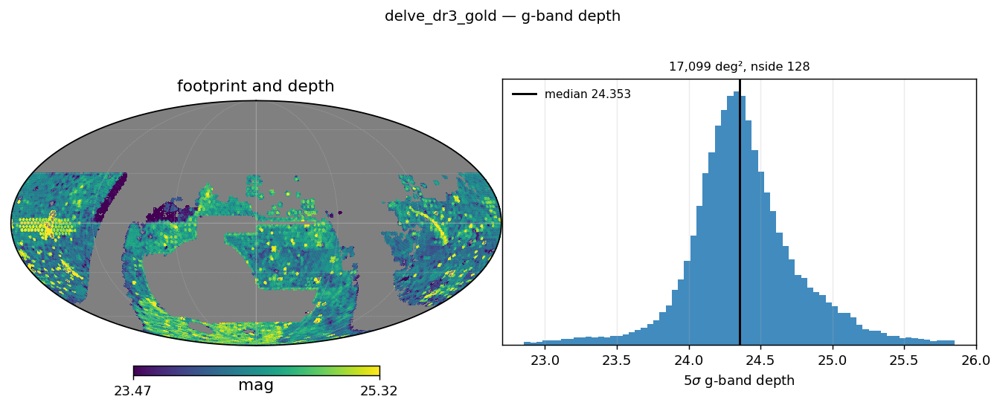
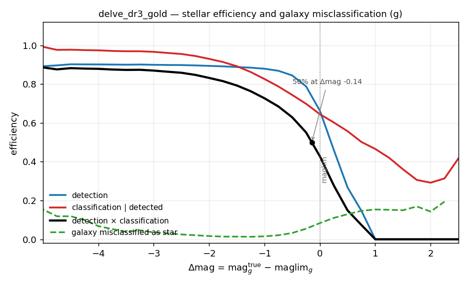
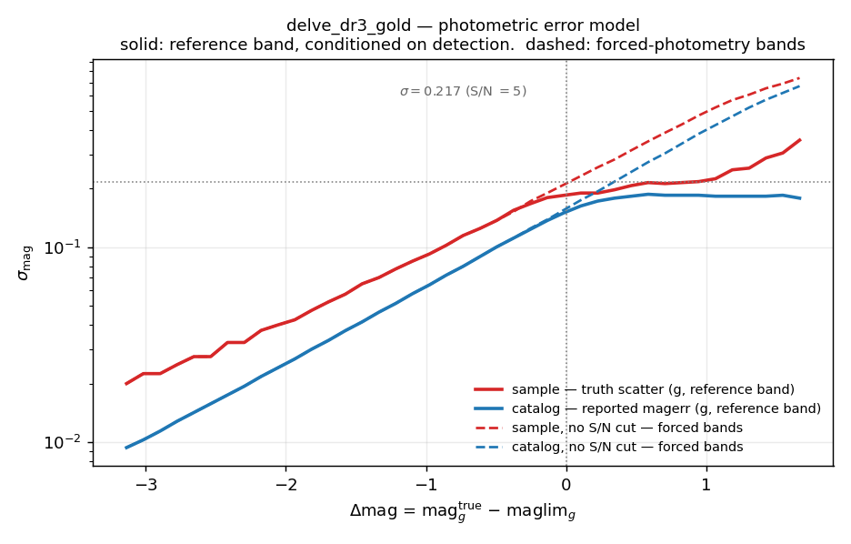

# DELVE

**DELVE** is supported by **StreamObs**.

## Available releases

| Release | Bands | Footprint | Reference band | Median reference-band depth |
|---|---|---|---|---|
| `dr3_gold` (DELVE DR3 Gold) | griz | 17,099 deg² (shipped maglim map) | g | 24.373 |

In the DES footprint, DELVE DR3 Gold *is* DES Y6 Gold — the two surveys share
imaging there — so this release is built to be mutually consistent with
{doc}`DES` on that overlap, and the overlap is the primary cross-check (see
*Validation* under *Creation* below).

## Products

All of the selection-function products are **derived from the DELVE Balrog
synthetic-source-injection catalogue** (`BalrogOfTheStars_Catalog_V4.hdf5`,
62,922,015 injected rows) by `scripts/des/balrog_selection_function.py
--survey delve`. The method, the evidence behind each choice and the runbook
are in {doc}`../balrog_selection_functions`; see *Creation* below for the
per-release summary. The derivation takes ~35 minutes wall time and ~48 GB
peak RAM on the full V4 catalogue.

| File | Contents |
|---|---|
| `delve_dr3_gold_maglim_{g,r,i,z}_nside128.fits.gz` | truth-anchored S/N = 5 depth maps |
| `delve_dr3_gold_stellar_efficiency_cutg.csv` | stellar detection + classification efficiency vs `delta_mag` |
| `delve_dr3_gold_photoerror_g.csv` | **sample** photo-error curve — truth scatter, drives the noise draw (reference band) |
| `delve_dr3_gold_photoerror_g_catalog.csv` | **catalog** photo-error curve — reported `magerr`, drives the S/N cut (reference band) |
| `delve_dr3_gold_photoerror_g_nocut.csv` | **sample**, no S/N cut — the noise draw for forced-photometry bands |
| `delve_dr3_gold_photoerror_g_catalog_nocut.csv` | **catalog**, no S/N cut — reported `magerr` for forced-photometry bands |
| `delve_dr3_gold_galaxy_misclass_cutg.csv` | fraction of detected true galaxies classified as point sources |
| `delve_dr3_gold_photoerror_g{,_catalog}{,_nocut}_raw.csv` | pre-afterburner provenance |
| `delve_dr3_gold_audit.json` | counts, anchors and convention flags for the run |

Reference band is **g**. The completeness and photo-error curves are keyed to
`delta_mag = mag_true − maglim(pixel)` and applied band-independently, so
colour is carried by the per-band depth maps rather than by separate per-band
tables.

## Depth and bands

Truth-anchored medians:

| band | truth-anchored depth |
|---|---|
| g | **24.373** |
| r | **23.962** |
| i | **23.389** |
| z | **22.951** |

Footprint of the shipped maglim map is **17,099 deg²**, at **nside 128**
(`delve_dr3_gold_maglim_{g,r,i,z}_nside128.fits.gz`). Each band's depth is
mosaicked from **two** input map files (DR3.2 and DR3.1.1+3.1.2), which are
exactly disjoint halves of the footprint (0.00% overlap, 99.76% union); this
is handled internally by the reducer and is transparent to a product user.

The V4 Balrog injects *griz* only, matching DES Y6, so no `u` or `Y` product
is derivable and none is shipped.



*The four anchor shifts all share a sign, which is the coherence check that
validates the anchor. Medians quoted on the histograms are of the written map,
which masks pixels deviating more than 1.5 mag from the band median, so they sit
~0.02 below the anchor values quoted below. The sky map shows the two disjoint
DR3 halves that are mosaicked into each band.*

## Photometric errors

Four curves ship, not two. The **reference band** g uses the `sample`/`catalog`
pair, which is measured on the detected population, since g's own photometry
is conditioned on its own detection. Every **other band** (r, i, z) is forced
photometry — measured at the g position, not conditioned on its own detection
— and uses the `_nocut` pair instead.

`Survey.get_photo_error(band=...)` picks the matching pair automatically and
**raises rather than guessing** if the required curve for a non-reference band
is not loaded, instead of silently applying the detected-population curve to
forced photometry.

## Using it in streamobs

Configured by `config/surveys/delve_dr3_gold.yaml`, data in
`data/surveys/delve_dr3_gold/`:

```python
from streamobs.surveys import SurveyFactory

survey = SurveyFactory.create_survey(
    "delve",
    release="dr3_gold"
)

maglim = survey.get_maglim("g", pixel=pix)

completeness = survey.get_completeness(
    "g",
    mag,
    maglim
)

photo_error = survey.get_photo_error(
    "g",
    mag,
    maglim
)
```

For a forced-photometry band, pass that band to `get_photo_error` (e.g.
`survey.get_photo_error("r", mag, maglim)`) — it automatically resolves to the
`_nocut` curve rather than the reference-band curve.

## Caveats

- **`EXT_XGB` — what a real DR3 Gold user would actually cut on — cannot be
  evaluated on Balrog**, for the same reason as DES Y6 (App. A.2 of Bechtol et
  al. 2025): the required features are never measured for injected sources.
  DELVE ships `bdf_extended_class_dr3gold` instead, which is exactly
  reproducible from `BDF_T`/`BDF_S2N` but is a *different* selection from an
  `EXT_XGB` cut. DES handles this gap with a trained surrogate plus
  deconvolution; **no equivalent surrogate is shipped for DELVE.**
- **There is no external validation of the DELVE star classification**
  comparable to the SPLASH-SXDF check done for DES. (That check validated
  completeness but could not measure contamination either — see {doc}`DES`.)
- **Galaxy misclassification is noise-dominated brightward of `delta_mag ≈
  −4`.** The true-galaxy counts per bin get small there and the rate swings
  wildly; treat the curve as reliable only faintward of that.
- **The efficiency table starts shallower on the bright side than DES's.**
  DELVE's table begins at `delta_mag = −5.0` (`mag_g` = 19.375), 3.4 mag
  shallower than DES's `−8.4` (`mag_g` = 16.625). Stars brighter than
  `g ≈ 19.4` are flat-extrapolated from the `−5.0` bin, where
  `detection_eff = 0.90`. `delta_saturation` is set to `−5.0` to match — treat
  completeness for very bright stars as indicative rather than measured.

## Creation

### How the injections work

The selection-function products are derived from the DELVE Balrog
synthetic-source-injection catalogue (`BalrogOfTheStars_Catalog_V4.hdf5`,
62,922,015 injected rows) by `scripts/des/balrog_selection_function.py
--survey delve`. The method, the evidence behind each choice and the full
runbook are in {doc}`../balrog_selection_functions`; this page carries only
the per-release summary. The derivation takes ~35 minutes wall time and ~48 GB
peak RAM on the full V4 catalogue.

Regenerate the figures on this page with
`python scripts/des/build_delve_survey_doc_figs.py`. There is deliberately no
surrogate-confusion figure and no external-validation figure, unlike
{doc}`DES`: DELVE needs no `EXT_XGB` surrogate, and no SPLASH-equivalent truth
catalogue overlaps the footprint.

### Depth-map derivation

The shift applied to each input map:

| band | input map median | truth-anchored | shift |
|---|---|---|---|
| g | 24.178 | **24.373** | +0.196 |
| r | 23.675 | **23.962** | +0.287 |
| i | 23.204 | **23.389** | +0.185 |
| z | 22.560 | **22.951** | +0.391 |

Each band's depth is mosaicked from **two** input map files (DR3.2 and
DR3.1.1+3.1.2), which are exactly disjoint halves of the footprint (0.00%
overlap, 99.76% union); passing only one silently drops ~half the injections
and produces an all-zero efficiency table. See
{doc}`../balrog_selection_functions` for the mosaicking details.

The shifts are smooth and all the **same sign** — the coherence check that
validates the anchor, same as DES. Unlike DES, whose shifts are all negative,
DELVE's are all **positive**: the input maps are slightly optimistic relative
to what the injections actually recover.

Pixels deviating more than 1.5 mag from their band median are masked when the
maps are written: g 29,872 (0.60%), r 49,822 (1.02%), i 30,806 (0.63%), z
25,535 (0.51%).

### Star/galaxy classification

`classification_eff` describes the **`bdf_extended_class_dr3gold`, 0 ≤ EXT ≤
1** selection. Unlike DES this needs **no surrogate, no deconvolution and no
deep-field truth join**: `bdf_extended_class_dr3gold` needs only `BDF_T` and
`BDF_S2N`, both of which are measured for injections, and truth labels come
from `truth_STAR`, which ships per row. The classifier reuses the **DES Y6
Gold interpolation nodes**, so DES and DELVE are classified identically — that
is what makes the two releases comparable in `delta_mag` space.

Counts behind the curve: 13,141,646 true stars binned; 8,361,275 detected
(63.6%); 7,140,687 classified (85.4% of detected). The bright-end detection
plateau sits at 0.901, and the combined (classification × detection)
efficiency crosses 50% at `delta_mag = −0.144`. The efficiency table spans
`delta_mag = −5.0` to `+2.5` (`mag_g` 19.375 to 26.875), 31 rows.

As of 2026-09-04, the V4 catalogue also carries a **persisted**
`bdf_extended_class_dr3gold` int8 column, computed by the same vendored
function the reducer uses, with provenance recorded in the dataset attrs.
Values run 0–4 plus a `−9` sentinel; the distribution is 32.2% point source
(0–1), 30.3% extended (2–4), 37.5% sentinel — the sentinel fraction is
dominated by the ~21% undetected injections, whose `meas_bdf_*` fields are all
`0.0` and so fail the `s2n > 0` test.



*Stellar detection and classification efficiency for the
`0 ≤ bdf_extended_class_dr3gold ≤ 1` selection, with the galaxy
misclassification rate on the same axes. The bright-end detection plateau sits
at 0.901 rather than near unity because the per-object quality flags
(`meas_flags`, `meas_bdf_flags`) are applied in the efficiency numerator — the
Roman/LSST convention. The shaded region marks where the misclassification
curve is noise-dominated; see *Caveats*.*

### Photometric-error derivation

The `sample`/`catalog` pair is measured on the detected population and applies
to the reference band g. The `_nocut` pair is measured without the
reference-band S/N cut and applies to r, i and z, which are forced at the g
position and so are not conditioned on their own detection.

The two pairs are identical brightward of the depth (22 bins agree to
within 1e-6) and diverge only faintward, where the S/N cut truncates the
detected sample: its measured scatter turns over and falls while the
`_nocut` curve keeps rising, up to **0.38 dex** apart. Using the detected
curve for forced photometry would understate faint-band errors.

Per-tile zero points were measured for 1,499 tiles (reference offset +0.0225,
spread `(16–84)/2` = 0.1758). 329 tiles deviated by more than 0.05 mag and were
**rejected, not corrected** — matching DES's own treatment of this class of
artifact — dropping 8,503,446 of the 62,922,015 injected rows. Rejecting
rather than correcting improved the error-inflation factor (truth scatter /
reported error) from 2.00 to 1.50; the shipped value is **1.502**. Because the
curves are `delta_mag`-keyed and the imaging is homogeneous within the survey,
they extrapolate to the full footprint — the maglim maps ship **unmasked**.

The bright-end cut removes bins with `delta_mag < −3.25` (23 of 64 raw bins,
leaving 41). The truth-scatter histogram has 0.005 mag bins, so a binned sigma
can only take multiples of 0.0025; brightward of `delta_mag ≈ −3.26` the curve
is pinned to that grid and reports the bin width rather than the scatter. The
first bin reaching `sigma = 0.020` — the same floor the cleaned DES curve has
— is `delta_mag = −3.256`. See
`scripts/des/delve_photoerror_corrections.yaml` for the full rationale.

The cleaned curve floors at 0.020 mag, which makes `sys_error: 0.005` safe
(3.1% in quadrature) — exactly as for DES.



*All four photo-error curves. Solid is the detected-population pair used for the
reference band g; dashed is the `_nocut` pair used for the forced-photometry
bands r, i and z. They agree brightward of the depth and separate only
faintward, where the S/N cut truncates the detected sample and its measured
scatter turns over rather than continuing to rise. The lower panel is the
error-inflation factor, ~1.5 near the limit.*

### Validation

Since DELVE DR3 Gold *is* DES Y6 Gold in the DES footprint, comparing the two
releases in `delta_mag` space is the primary validation for this release — it
needs no sky overlap, unlike a positional cross-match. Over
`−4 < delta_mag < 0`:

- the combined efficiency curves agree to a **median absolute difference of
  0.063** (max 0.292);
- the photo-error curves agree to **0.020 dex**.

### Derivation-level limitations

- **`classification_eff` turns up faintward of `delta_mag ≈ 1.75`** (0.29 →
  0.42 by 2.5). This is small-N noise, and is harmless because the faint clamp
  (`DET_EFF_DELTA_MAX = 1.0`) zeroes `detection_eff` and
  `classification_detection_eff` for `delta_mag > 1` regardless.

Questions about these files can be addressed to Peter Ferguson.
