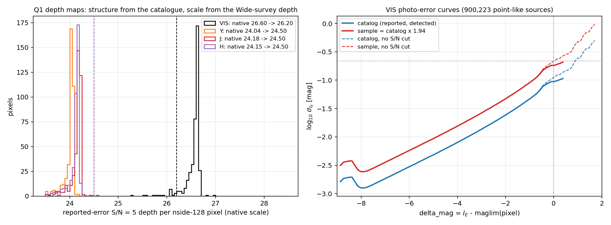
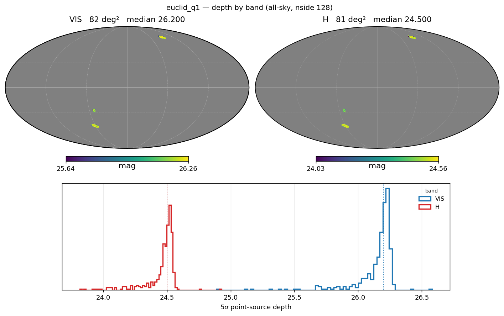
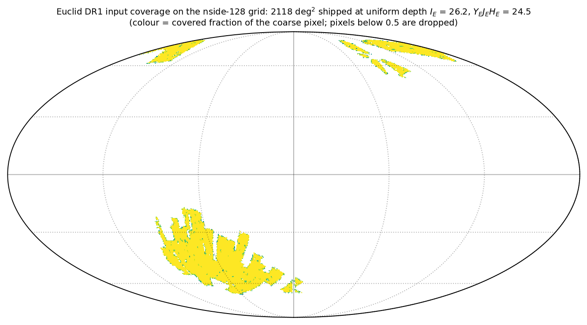
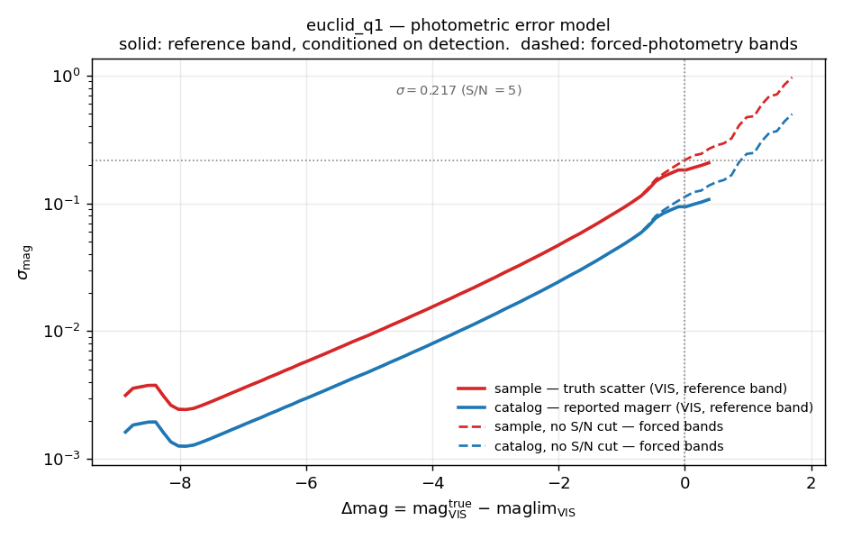
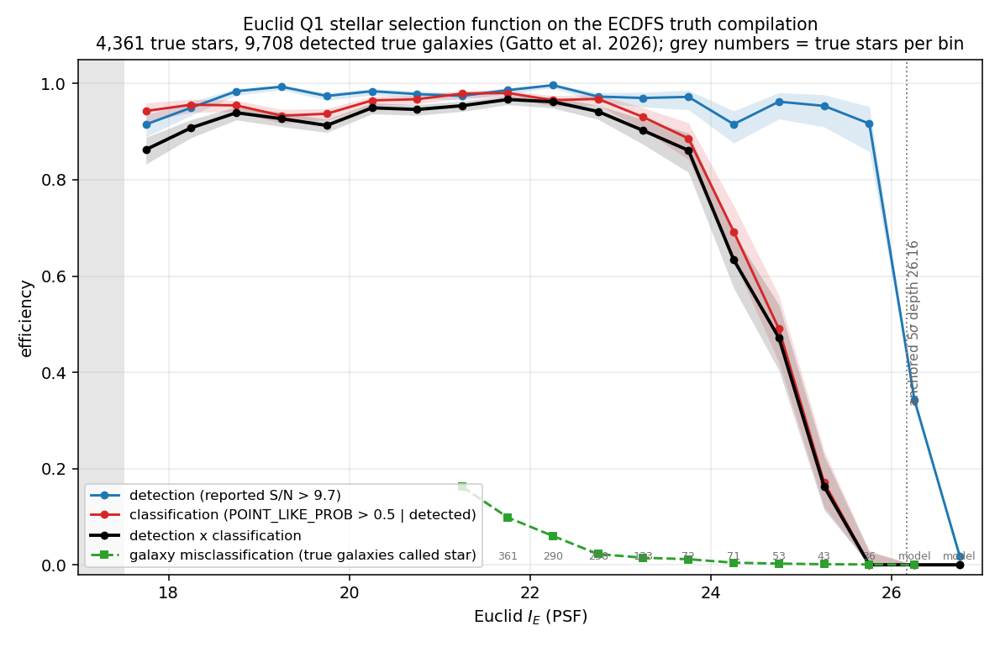

# Euclid

**Euclid** is supported by **StreamObs**.

## Available releases

| release | bands | footprint | reference band | median reference-band depth |
|---|---|---|---|---|
| `euclid/q1` (Q1, the three Deep Fields at Wide depth) | VIS, Y, J, H | 63.1 deg² of imaging; 81.8 deg² of nside-128 pixels | VIS | 26.200 (anchored) |
| `euclid/dr1` (DR1 footprint, uniform fiducial depth) | VIS, Y, J, H | 2,118 deg² | VIS | 26.200 (uniform) |

`euclid/q1` is the release the selection function is **derived** on: the Euclid
Quick Data Release 1 ([Euclid Collaboration 2025, Q1 overview](https://arxiv.org/abs/2503.15302))
covers EDF-North, EDF-Fornax and EDF-South at the nominal depth of a single
Wide-survey pass, published as the MER Final Catalog
([Euclid Collaboration: Romelli et al.](https://arxiv.org/abs/2503.15305); 29.8M
sources). `euclid/dr1` reuses its tables on the DR1 footprint, the way
{doc}`LSST` `dp2` reuses the `dc2` tables and the {doc}`Roman` HLWAS tiers reuse
`dc2`'s.

Band names follow the ugali `euclid` isochrone set (PARSEC CMD 3.9, *Euclid
VIS+NISP (ABmags)*): `VIS`, `Y`, `J`, `H`. The isochrones are already AB, so
unlike Roman (whose Vega files ugali converts when reading them) no Vega→AB
offset is applied.

## Products

| File | Contents |
|---|---|
| `euclid_q1_maglim_{vis,y,j,h}_nside128.fits.gz` | 5σ point-source depth maps, anchored (see *Depth and bands*) |
| `euclid_dr1_maglim_{vis,y,j,h}_nside128.fits.gz` | DR1 footprint at the uniform anchored depth |
| `euclid_q1_stellar_efficiency_cutvis.csv` | `mag_VIS, delta_mag, detection_eff, classification_eff, classification_detection_eff` |
| `euclid_q1_photoerror_vis_catalog.csv` | **catalog** curve — median reported PSF `magerr`, drives the S/N cut (reference band) |
| `euclid_q1_photoerror_vis.csv` | **sample** curve — catalog × 1.94, drives the noise draw (reference band) |
| `euclid_q1_photoerror_vis_catalog_nocut.csv`, `euclid_q1_photoerror_vis_nocut.csv` | the same pair with no S/N cut — for the forced-photometry bands Y, J, H |
| `euclid_q1_galaxy_misclass_cutvis.csv` | `mag_VIS, delta_mag, missclassification_eff` — detected true galaxies called star |
| `euclid_q1_audit.json`, `euclid_dr1_audit.json` | counts, anchors, inflation factor, extinction derivation |

Reference band is **VIS** (I_E), measured with `FLUX_VIS_PSF`. The curves are
keyed to `delta_mag = mag_true − maglim(pixel)` and applied band-independently;
colour is carried by the per-band depth maps. The NISP bands use
`FLUX_{Y,J,H}_TEMPLFIT`, the template-fit flux measured with the VIS detection
as prior — forced photometry at the VIS position, which is exactly the role
streamobs assigns to every non-reference band. The aperture fluxes
(`FLUX_*_2FWHM_APER`) are **not** aperture-corrected (stars sit 0.09 mag fainter
in VIS and 0.12–0.15 mag fainter in Y/J/H than in PSF/TEMPLFIT) and their
reported S/N = 5 lands ~1.2 mag shallower, so they are not used.

## Depth and bands

| band | photometry | catalogue-derived median | anchored | shift |
|---|---|---|---|---|
| VIS | `FLUX_VIS_PSF` | 26.602 | **26.200** | −0.402 |
| Y | `FLUX_Y_TEMPLFIT` | 24.036 | **24.500** | +0.464 |
| J | `FLUX_J_TEMPLFIT` | 24.183 | **24.500** | +0.317 |
| H | `FLUX_H_TEMPLFIT` | 24.148 | **24.500** | +0.352 |

The maps are **anchored to the Euclid Wide Survey 5σ point-source depths** of
[Scaramella et al. 2022](https://arxiv.org/abs/2108.01201) — I_E = 26.2,
Y_E J_E H_E = 24.5 — to which Q1 was observed. The catalogue supplies the spatial
structure: for every point-like source (`POINT_LIKE_PROB > 0.5`,
`SPURIOUS_FLAG == 0`) at 20 < S/N < 60 the reported error is carried to S/N = 5
with the background-limited relation m₅ = m + 2.5 log₁₀(S/N / 5), and each
nside-128 pixel takes the median of at least 20 such objects. The median of that
map is then shifted onto the published depth, as the DES healsparse maps are
shifted onto their Balrog anchor ({doc}`DES`).

Anchoring is needed because the MER reported errors do **not** follow the
background-limited scaling: `log10(magerr)` grows by 0.19–0.20 dex/mag in every
band over 10 < S/N < 100, not 0.4. A "native" S/N = 5 depth therefore depends on
where it is read — 26.6 when extrapolated from S/N 20–60, 27.2 at the reported
S/N = 5 crossing — and over-shoots the delivered VIS depth by 0.4–1.0 mag. That is
the Roman DC2 situation ({doc}`../selection_function_methodology`, *Depth
maps*), where the remedy is to anchor to the truth-based scatter. Euclid has no
injection catalogue, and the truth compilation used below carries no Euclid-band
photometry (a colour transform from its DP1 *riz* magnitudes floors at 0.17 mag
scatter), so the published depth is the only anchor available.



*Left: the catalogue-derived depth per nside-128 pixel in each band (native
scale) with the anchored median dashed. The VIS distribution is tight (0.1 mag
core); the low tail is edge pixels. Right: the four VIS photo-error curves, see
below.*



The shipped `euclid/q1` maps cover **81.8 deg²** of nside-128 pixels (0.21 deg²
each) for 63.1 deg² of imaging: an edge pixel is kept as soon as it holds 20
point-like sources. No pixel deviates from its band median by more than the 1.5
mag clip.

**`euclid/dr1`** is the DR1 *input coverage map* (`cgv_map_dr1input_o13.fits.gz`,
an nside-8192 binary mask, 2108.5 deg²) degraded to the covered fraction per
nside-128 pixel; a pixel is kept when that fraction is ≥ 0.5, which preserves
the area (**2,118 deg²**) rather than inflating it by 10–20% as an any-subpixel
rule would at this resolution. Every kept pixel carries the anchored Q1 median
of its band — DR1 is observed with the same instrument, exposure sequence and
pipeline as the Q1 Wide-depth pass. Depth variations across DR1 (exposure
count, zodiacal background, stray light) are **not** in these maps; swap in a
measured DR1 depth map when one exists.



## Photometric errors

Four curves ship, not two. The **reference band** VIS uses the `sample`/`catalog`
pair measured on the detected population; every **other band** (Y, J, H) is
forced photometry and uses the `_nocut` pair, measured with no S/N cut.
`Survey.get_photo_error(band=...)` picks the matching pair and raises rather
than guessing if the curve a non-reference band needs is not loaded.

The **catalog** curve is the median reported PSF `magerr` of the 900,223
point-like, non-spurious Q1 sources, in bins of `delta_mag` against the anchored
VIS map. The **sample** curve is the catalog curve scaled by the
**error-inflation factor f = 1.94**, which is what the anchor implies: at the
anchored depth the median reported σ of point-like sources is 0.112 mag where a
5σ depth means 0.217, so f = 0.217 / 0.112. On the no-cut population the sample
curve therefore reaches σ = 0.217 at `delta_mag = 0` by construction — the
property truth anchoring enforces — and on the detected population it reads
0.182 there, less because the S/N cut truncates the noisy tail (the LSST DC2
curve shows the same 0.18 for the same reason). This is **an assumption, not a
measurement**: a constant factor is the minimal one, and the Roman DC2 factor
*was* flat at ≈2, but nothing here can test it (see *Known limitations*).

Detection is defined consistently with the anchor: a source is *detected* when
its **reported S/N exceeds 5 f = 9.7**, i.e. its true S/N exceeds 5. The two
catalog curves are identical brightward of `delta_mag ≈ −0.5` and diverge
faintward, where this cut truncates the detected sample; the no-cut curve keeps
rising to 1.0 mag errors at `delta_mag = +1.7`. The catalog curve crosses
S/N = 10 at `delta_mag = +0.38`, faintward of the depth — the same optimism seen
from the other side.



`sys_error = 0.005` is the package default and has not been measured for Euclid.

## Extinction coefficients

| band | pivot λ (Å) | F99, R_V = 3.1 | adopted A_band / E(B−V)_SFD |
|---|---|---|---|
| VIS | 7103 | 2.081 | **1.790** |
| Y | 10785 | 1.022 | **0.879** |
| J | 13621 | 0.691 | **0.595** |
| H | 17649 | 0.465 | **0.400** |

Fitzpatrick (1999) with R_V = 3.1, evaluated at the pivot wavelengths of the
[SVO Filter Profile Service](http://svo2.cab.inta-csic.es/theory/fps/) entries
`Euclid/VIS.vis` and `Euclid/NISP.{Y,J,H}`, and multiplied by the
Schlafly & Finkbeiner (2011) factor 0.86. That puts them on the same E(B−V)_SFD
footing as the {doc}`DES` and {doc}`DELVE` coefficients (SF11 Table 6 is
0.86 × F99 for the DECam bands). The band ratios agree with the G23-curve values
the Euclid Q1 LDN 1641 extinction paper quotes (A_λ/A_V = 0.678 / 0.366 / 0.261 /
0.160 → 2.10 / 1.13 / 0.81 / 0.50 per E(B−V)) to within the SED dependence one
expects for a band as broad as VIS. The LSST releases use rubin_sim coefficients
without the 0.86 factor, so Euclid-vs-LSST extinction is not on a common footing;
Euclid-vs-DES is.

## Using it in streamobs

Configured by `config/surveys/euclid_{q1,dr1}.yaml`, data in
`data/surveys/euclid_{q1,dr1}/`:

```python
from streamobs.surveys import SurveyFactory

survey = SurveyFactory.create_survey("euclid", release="dr1")

maglim = survey.get_maglim("VIS", pixel=pix)
completeness = survey.get_completeness("VIS", mag, maglim)
photo_error = survey.get_photo_error("VIS", mag, maglim)

# a forced-photometry band resolves to the _nocut curves automatically
photo_error_H = survey.get_photo_error("H", mag_H, survey.get_maglim("H", pixel=pix))
```

For an isochrone, `survey: euclid`. The bands are sampled on demand from the
injector's `bands` (e.g. `VIS, Y, J, H`), or listed as `bands: [VIS, H]` to set
the ones `StreamModel` produces on its own; with none listed, that is the whole
ugali set (`VIS Y Blue J Red H`). The multi-survey form in
{doc}`../multisurvey` works unchanged, e.g. `surveys: [des, euclid]`.

## Caveats

- **The classification curve describes `POINT_LIKE_PROB > 0.5`.** `MUMAX_MINUS_MAG`
  cuts are more complete and less pure at the faint end; `POINT_LIKE_FLAG` is set
  for only 9% of objects and is not a general classifier; `EXTENDED_FLAG` /
  `EXTENDED_PROB` are unpopulated in Q1. A different stellar selection on real
  data is not described by the shipped `classification_eff`.
- **Stars brighter than I_E = 17.5 are unclassifiable** (`POINT_LIKE_PROB` is
  undefined for 96% of sources brighter than 17.0 and the point-like fraction
  collapses across 17.5 → 16.5), which is what `saturation_VIS: 17.5` encodes.
  The NISP saturation of 15.5 is a floor — the TEMPLFIT S/N still rises down to
  16.0 and the brightest point-like stars sit at 15.4 — not a measurement.
- **`DET_QUALITY_FLAG` is not part of the selection.** It is set on 94% of stars
  brighter than I_E = 19 (bright-star bits), so `== 0` is not a point-source
  quality cut; only `SPURIOUS_FLAG == 0` is applied (100% of truth sources pass).
- **Both `euclid/q1` and `euclid/dr1` sit on the anchored scale**, so
  `delta_mag = 0` means the Wide-survey 5σ depth, not the catalogue's reported
  S/N = 5. Compare against real Q1 photometry with that in mind: at the depth the
  catalogue reports S/N ≈ 9.7.

## Creation

Everything is built by `scripts/euclid/build_euclid_selection_function.py`
(Q1 products and the two derivation figures, 5 s) followed by
`scripts/euclid/build_euclid_dr1_maglim_maps.py` (DR1 maps + table symlinks);
the standard depth / efficiency / photo-error figures come from
`scripts/build_survey_doc_figs.py euclid_q1 euclid_dr1`. The methodology the
products follow is {doc}`../selection_function_methodology`.

### The truth catalogue

The stellar efficiency and the galaxy misclassification are measured on the
ECDFS spectroscopic compilation of [Gatto et al. 2026 (A&A 709, A79)](https://arxiv.org/abs/2603.25262):
15,611 sources with spectroscopic or Gaia star/galaxy labels (4,361 stars,
11,250 galaxies) over 1.35° × 1.16° in the CDFS/ECDFS, which sits inside
EDF-Fornax. It is matched to Q1 at 1″ independently of any other survey; 97.6%
of the sources have a counterpart, and the non-matches are a depth limit rather
than a coverage gap (the largest separation of any source is 29″).

A truth star is **detected** when it has a counterpart with a valid PSF flux,
`SPURIOUS_FLAG == 0` and reported S/N > 9.7 (true S/N > 5 under the anchor); it
is **classified** when `POINT_LIKE_PROB > 0.5`. The magnitude axis is the observed
PSF I_E; the 143 truth stars without one (undetected, or no PSF flux) take a DP1
(*r, i, z*) colour transform fitted on the matched stars
(I_E − i = 0.657 − 0.429 (r−i) + 0.468 (i−z), 0.17 mag scatter) so that they stay
in the denominator, and 7 stars with no magnitude at all are dropped. Bins hold
0.5 mag and need 20 true stars. `delta_mag` is keyed to the anchored VIS depth
over the ECDFS cone, 26.164.



*Detection stays at the 0.97 plateau to within 0.3 mag of the depth; the
classifier is what fails first, losing half the stars by I_E ≈ 24.8 and all of
them by 25.75. The two faintest bins are the S/N-threshold model, see below.*

| I_E | detection | classification (of detected) | detection × classification | true stars |
|---|---|---|---|---|
| 18.25 | 0.950 | 0.956 | 0.908 | 239 |
| 20.25 | 0.984 | 0.965 | 0.949 | 376 |
| 22.25 | 0.997 | 0.965 | 0.962 | 290 |
| 23.75 | 0.972 | 0.886 | 0.861 | 72 |
| 24.75 | 0.962 | 0.490 | 0.472 | 53 |
| 25.25 | 0.953 | 0.171 | 0.163 | 43 |
| 25.75 | 0.917 | 0.000 | 0.000 | 12 (classification: 11 detected) |

The 3% detection loss on the plateau is a mix of the 1″ match (Gaia stars with
proper motion between the DP1 and Euclid epochs), objects without a PSF flux and
spurious flags; the 17.75 bin (0.915 / 0.943) is partly saturated. The galaxy
misclassification is the fraction of **detected true galaxies** with
`POINT_LIKE_PROB > 0.5`, in bins of their observed I_E with at least 100
galaxies: 16% at I_E = 21.25 falling to 1% by 24 and 0.1% by 25.5. The bright
end is a property of the truth sample as much as of the classifier —
spectroscopic "galaxies" at I_E ≈ 21 include QSOs, which *are* point sources.

### Faint-end extension of the detection curve

The compilation runs out of stars at the depth itself (12 at 25.75, fewer than
the 20-star floor beyond), and streamobs fills zero past a table's last row,
which would turn a measured 0.92 into 0 across one bin. The two bins between the
last measured one and `delta_mag = +1` (I_E = 26.25 and 26.75) are therefore
filled with what a hard S/N > 5 cut does to Gaussian flux noise,
P = Φ(5 (10^(−0.4 Δ) − 1)) scaled by the measured 0.974 plateau — 0.34 and 0.02 —
with `classification_eff` held at its last measured value. **These two rows are a
model, not a measurement**; the audit records `n_model_extended_bins: 2`, and
they are gone as soon as a deeper truth sample exists.

### What the DP1/DP2 transforms rule out

Two independent attempts to give the truth stars an Euclid-band *true*
magnitude — DP1 *riz* from the compilation itself and LSST DP2 PSF *riz* matched
separately — both floor at 0.10–0.17 mag scatter even for stars at I_E 19–22
with 0.002 mag reported errors, because VIS is too broad (497–932 nm) to be
predicted from three optical bands at that precision. That is why neither a
truth-based depth anchor nor a measured sample curve is possible here, and why
the sample curve is the catalog curve × f instead.

## Known limitations

1. **The sample photo-error curve is assumed, not measured.** The factor 1.94 is
   what the published depth implies about the reported errors *at the depth*;
   applying it as a constant across 9 magnitudes is an assumption. A Euclid
   injection catalogue, or a deep Euclid-band truth (e.g. the Euclid Deep
   Survey itself once released at full depth), would replace it.
2. **The depth zero-point is the survey requirement, not a measurement on Q1.**
   If Q1 delivered more or less than 26.2 / 24.5, every curve shifts with it.
3. **The detection roll-off is thin.** Detection is measured to I_E = 25.75 and
   modelled beyond; the classification roll-off (the quantity that matters for a
   stream search) is measured throughout.
4. **DR1 depth is uniform.** Real DR1 depth varies with exposure count and
   background; the maps carry only the footprint.
5. **NISP saturation and `sys_error` are not measured**, and the galaxy
   misclassification brightward of I_E ≈ 22 is dominated by QSOs in the truth
   sample.
6. **Extinction coefficients are evaluated at the pivot wavelength**, not
   integrated over the passband for a stellar SED; for VIS that is a several
   per cent effect.

Questions about these files can be addressed to Peter Ferguson.
