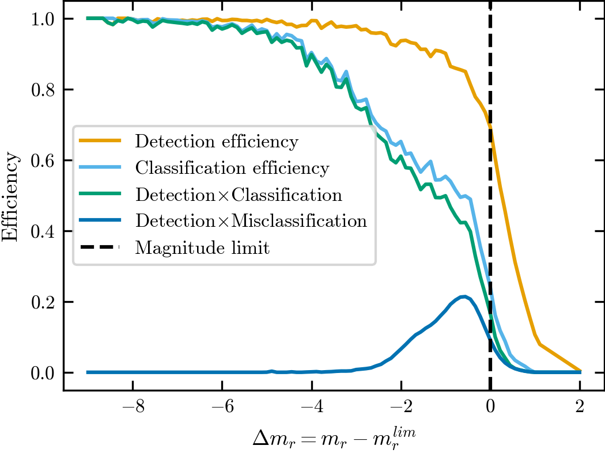
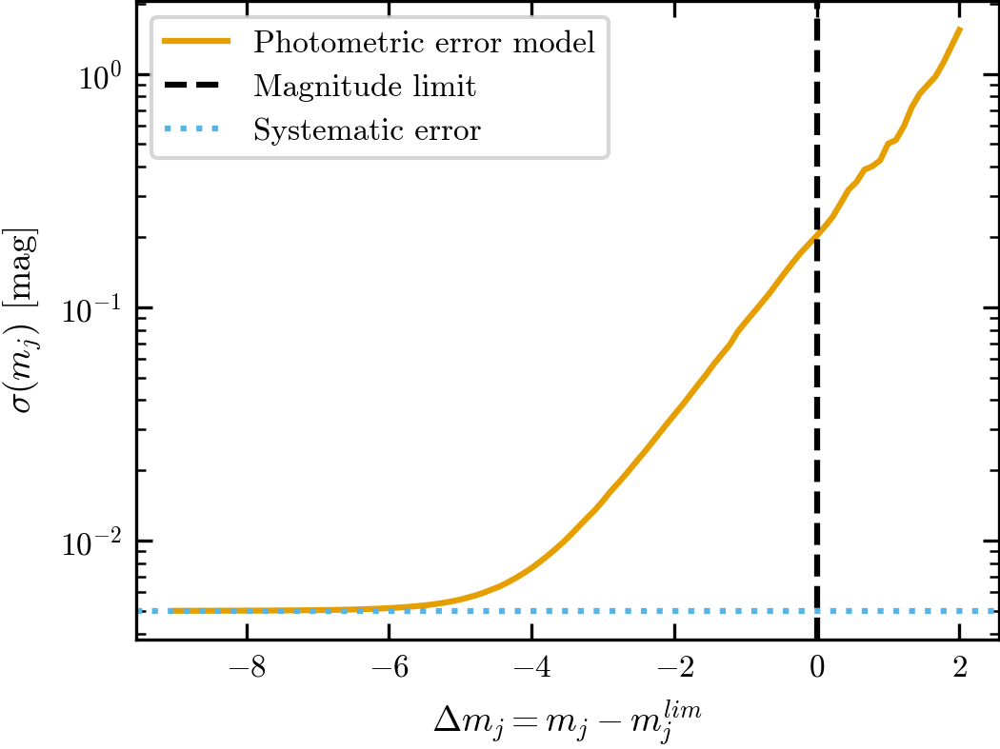
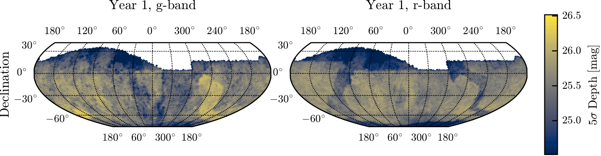
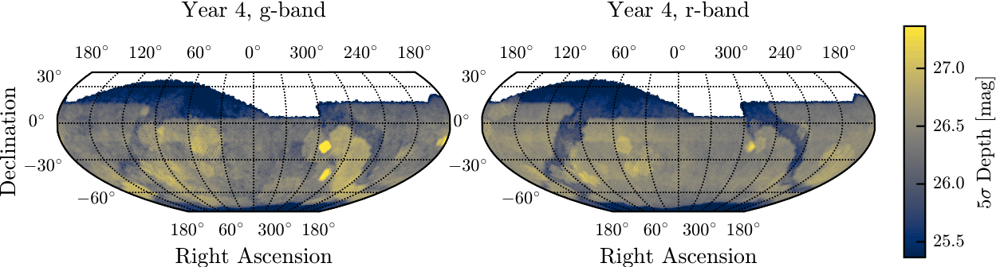

# LSST

**LSST** is supported by **StreamObs**.

## Available releases
Current estimation of LSST performances are done using DC2 simulations (expected
performances for LSST year 5), and extrapolated for year 1 to 5.

## LSST DC2 Survey Files
More information about the LSST simulations can be found in Pélissier et. all (2026).

This page is the **data sheet** for the `lsst / dc2` release: the survey-specific numbers, products, and figures. For **how** these products are derived (matched truth catalogs, completeness estimation, photometric-error calibration, depth-map construction, and analysis selections), see the survey-agnostic :doc:`selection_function_methodology`.

### The simulated survey

All quantities are measured from the LSST Dark Energy Science Collaboration Data Challenge 2 (DC2) simulations, a realistic realization of the expected Rubin LSST survey performance based on five years of observations. DC2 contains both truth and measured catalogs, enabling direct characterization of survey selection effects and photometric performance.

The truth catalog contains intrinsic object properties including noiseless magnitudes, positions, and morphological parameters. Galaxies are drawn from the cosmoDC2 catalog while stars are generated from the Galfast Milky Way model. Measured catalogs are produced by passing these objects through the full LSST image simulation and data reduction pipeline, including realistic observing conditions, instrumental effects, object detection, and photometric measurements. Objects in the measured catalog are matched to their truth counterparts through positional associations, allowing direct estimation of photometric uncertainties, detection efficiencies, and classification performance.

### Stellar completeness and classification

The stellar selection function is estimated from matched truth and measured
catalogs using the distance to the local magnitude limit, while the
classification efficiency measures the fraction of detected stars classified as
point sources using the LSST `EXTENDEDNESS` classifier.

The combined efficiency is the product of the detection and classification
efficiencies and is used by `StreamObs` to probabilistically determine whether
injected stars are observed.

Compact galaxies can be incorrectly classified as stars, producing an important contaminant population for stellar-stream analyses.

The galaxy contamination model is derived from true galaxies with

$$
{\rm size_true} < 0.3\ {\rm arcsec},
$$

for which morphological star-galaxy separation becomes challenging near the survey magnitude limit.




*Detection efficiency, stellar classification efficiency, combined stellar efficiency, and galaxy contamination efficiency as a function of distance to the local magnitude limit.*


### Photometric errors
Error model for LSST is taken from [Tsiane et al.2025](https://arxiv.org/abs/2504.16203).
They are derived directly from matched DC2 truth catalogs and are parameterized as a function of distance to the local magnitude limit,

$$
\Delta m_j = m_j - m_{{\rm lim},j}.
$$

The photometric scatter increases rapidly near the magnitude limit and approaches a systematic floor of approximately 0.005 mag for bright sources.




*Photometric uncertainty as a function of distance to the local magnitude limit.
An analytic approximation not used in StreamObs is overlaid on the DC2-derived
model.*


### Survey depth

Depth maps describe the spatial variation of the LSST 5σ limiting magnitude across the survey footprint.

Magnitude limits are obtained from [RubinSim](https://rubin-sim.lsst.io/) and propagated to `StreamObs` as `HEALPix` maps. Survey systematics are modeled through spatial variations in these limiting magnitudes, which drive both photometric uncertainties and selection functions.




*LSST 5σ limiting magnitude maps in the g and r bands for Year 1 and Year 4 survey configurations.*

### Extinction coefficients

Dust extinction is modeled using the Schlegel et. all (1998) reddening maps.

The adopted extinction coefficients are

| Filter | A_band / E(B−V) |
| ------ | --------------- |
| g      | 3.66            |
| r      | 2.70            |

These values are used to compute

$$
A_j = R_j E(B-V),
$$

and are applied consistently when generating observed magnitudes.


### Using the survey in streamobs

Configured by `config/surveys/lsst_{releases}.yaml`, data in `data/surveys/lsst_{releases}/`:

```python
from streamobs.surveys import SurveyFactory

survey = SurveyFactory.create_survey(
    "lsst",
    release="yr1"
)

maglim = survey.get_maglim("r", pixel=pix)

completeness = survey.get_completeness(
    "r",
    mag,
    maglim
)

photo_error = survey.get_photo_error(
    "r",
    mag,
    maglim
)
```


### Caveats

* Selection functions are derived from a limited DC2 calibration region and extrapolated across the full footprint through the local magnitude limit parameterization.
* Survey systematics are modeled primarily through depth variations; PSF
  variations are not explicitly included.
* DC2 simulations corresponds to 5 years of observation with LSST, thus releases
  up to 10 years of LSST cannot be extrapolated.