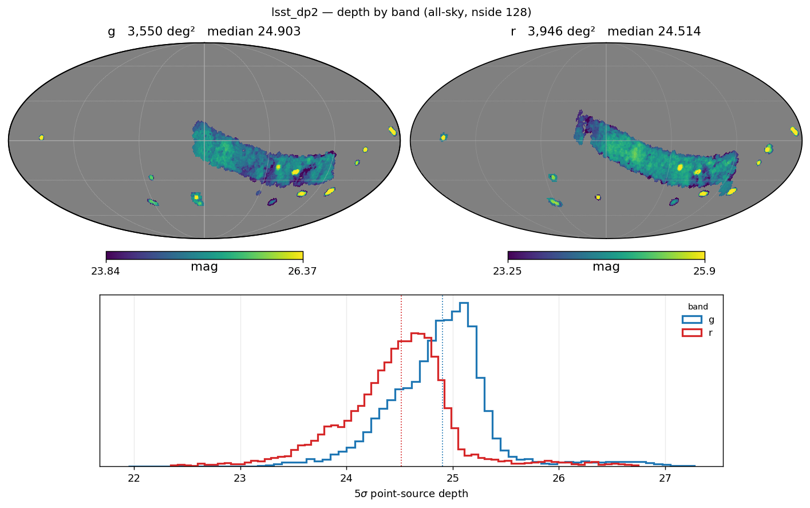
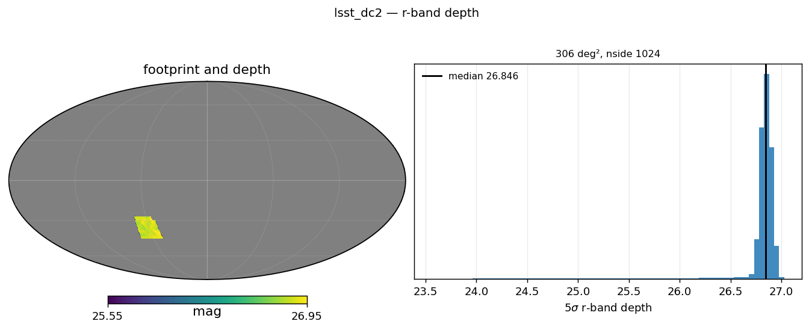
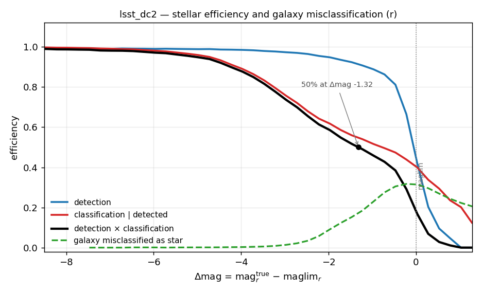
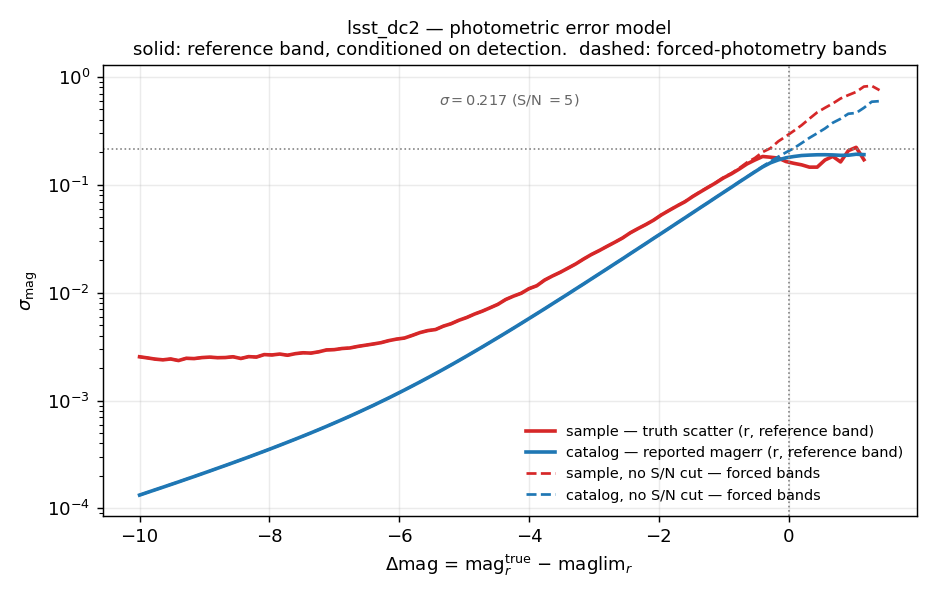

# LSST

**LSST** is supported by **StreamObs**. Current estimates of LSST performance
are calibrated on DC2 simulations (expected performance for LSST year 5), and
extrapolated to years 1 through 5. More information about the underlying LSST
simulations can be found in Pélissier et al. (2026).

## Available releases

| release | bands | footprint | reference band | median reference-band depth |
|---|---|---|---|---|
| `lsst/dc2` | g, r | ~327 deg² (DESC DC2 Run 2.2i region) | r | 26.839 |
| `lsst/yr1` … `yr5` | g, r | ~27,800–39,900 deg² depending on year and band (see *Depth and bands*) | r | 25.544 (yr1) – 26.408 (yr4); 26.308 (yr5) |
| `lsst/dp2` | g, r | g 3,550 deg², r 3,946 deg² (84.1% overlap) | r | 24.514 |

## Products

| File(s) | Contents | Drives |
|---|---|---|
| `lsst_dc2_maglim_{g,r}_nside1024.fits.gz` (`dc2`); `baseline_v5.0.0_year_{N}.0_band_{g,r}_nside_128.hsp` (`yr1`…`yr5`); `dp2_deepCoadd_psf_maglim_consolidated_map_weighted_mean_{g,r}_nside_128.hsp` (`dp2`) | HEALPix 5σ point-source depth map, one file per band | `Survey.get_maglim(band, pixel)` |
| `lsst_dc2_stellar_efficiency_cutr.csv` | `mag_r, delta_mag, detection_eff, classification_eff, classification_detection_eff` | `Survey.get_completeness(band, mag, maglim)` — detection + star-classification probability |
| `lsst_dc2_photoerror_r.csv` (**sample**) / `lsst_dc2_photoerror_r_catalog.csv` (**catalog**) | `delta_mag, log_mag_err` | reference-band (r) magnitude noise draw / reported-error S/N cut |
| `lsst_dc2_photoerror_r_nocut.csv` / `lsst_dc2_photoerror_r_catalog_nocut.csv` | same columns, no S/N selection applied | every other configured band (forced photometry) |
| `lsst_dc2_galaxy_misclass_cutr.csv` | `delta_mag, misclass_rate` | compact-galaxy contamination rate (informational; not yet consumed by the injector) |
| `ebv_sfd98_lowres_nside_512_ring_equatorial.fits` | E(B−V) HEALPix map, shared across releases | `Survey.get_extinction(band, pixel)` |

All three release families (`dc2`, `yr1`…`yr5`, `dp2`) share the same
completeness, photo-error, and galaxy-misclassification tables above — only
the depth map differs. See *Creation* for how that sharing is
implemented.

## Depth and bands

**`lsst/dc2`** — `lsst_dc2_maglim_{g,r}_nside1024.fits.gz`, HEALPix at
**nside 128**, median depth r = 26.839, g = 26.963 over ~327 deg² (the DESC
DC2 Run 2.2i footprint).

> **As of 2026-09 this map is *not* truth-anchored.** It ships on its native
> reported-error S/N = 5 scale (previously it was truth-anchored, with an
> r-band median of 26.517). See *Validation* below for why this
> changed.

**`lsst/yr1` … `yr5`** — `baseline_v5.0.0_year_{N}.0_band_{g,r}_nside_128.hsp`,
HealSparse at **nside 128**, RubinSim baseline v5.0.0 per year:

| year | g median | g footprint | r median | r footprint |
|---|---|---|---|---|
| 1 | 25.485 | 27,822 deg² | 25.544 | 27,884 deg² |
| 2 | 25.857 | 31,317 deg² | 26.016 | 27,943 deg² |
| 3 | 26.166 | 27,931 deg² | 26.268 | 28,016 deg² |
| 4 | 26.312 | 27,977 deg² | 26.408 | 28,044 deg² |
| 5 | 26.427 | 27,999 deg² | 26.308 | 39,875 deg² |

Footprint and median depth do not grow strictly monotonically per band per
year (notably g in year 2 and r in year 5) — this reflects RubinSim's own
per-year scheduler allocation across the WFD and mini-surveys, not a data
error. Per-year depth maps are also plotted individually:
`../_static/lsst_yr{1,2,3,4,5}/lsst_yr{N}_depth.png`.

**`lsst/dp2`** — `dp2_deepCoadd_psf_maglim_consolidated_map_weighted_mean_{g,r}_nside_128.hsp`,
HealSparse at **nside 128**. This is degraded (mean reduction) from a native
nside-512 source map whose own medians are g = 24.925 over 3,388 deg², r =
24.544 over 3,759 deg². Degrading to the shipped nside-128 map moves the
medians down 0.02–0.03 mag and grows the footprint ~5% (coarse pixels that
were only partially covered become fully valid, and averaging pulls in
shallower edge pixels — both are expected): the shipped map's median depth is
g = 24.903 over 3,550 deg², r = 24.514 over 3,946 deg², overlapping on 84.1%
of the larger. streamobs handles this per band through the individual maglim
maps, so the usable two-band area is the intersection rather than either
number above.



> **Not truth-anchored.** There is no injection catalogue for DP2, so there is
> nothing to anchor against, and the maps ship on their own native 5σ scale —
> the same footing as `lsst/dc2` above, and unlike {doc}`DES` and {doc}`DELVE`,
> whose absolute scales are set from their injections. The absolute depth
> scale is therefore inherited from whoever produced the maps rather than
> measured here.



*LSST 5σ limiting magnitude maps in the g and r bands for Year 1 and Year 4
survey configurations.*

**Band coverage.** All releases are configured with `bands: [u, g, r, i, z, y]`
(used for extinction, see *Extinction coefficients*),
but only **g and r** ship maglim maps and selection-function curves. `get_maglim`,
`get_completeness`, and `get_photo_error` are only usable for g and r unless
additional per-band depth maps are supplied.

## Photometric errors

The reference band is **r** (`completeness_band: r`). `Survey.get_photo_error`
carries two pairs of `delta_mag, log_mag_err` curves and picks between them
automatically:

- For the **reference band (r)**: the **sample** curve
  (`lsst_dc2_photoerror_r.csv`, truth-based scatter of obs − true — drives the
  per-source noise draw) and the **catalog** curve
  (`lsst_dc2_photoerror_r_catalog.csv`, median reported `magerr` — drives the
  S/N cut). Both are measured on the S/N > 5 *detected* population, because
  that is the population the reference-band curve is applied to.
- For **every other band** (u, g\*, i, z, y — forced photometry from the r-band
  detection): the `_nocut` pair (`lsst_dc2_photoerror_r_nocut.csv`,
  `lsst_dc2_photoerror_r_catalog_nocut.csv`), measured with **no** S/N
  selection, because a non-reference band's photometry is not conditioned on
  detection in that band. Using the detected-population curve there would
  understate the errors.

Call `survey.get_photo_error(band, mag, maglim, kind="sample"|"catalog")`;
StreamObs resolves the correct pair from `band` and **raises `ValueError`**
if the `_nocut` curve a non-reference band needs is not loaded, rather than
silently falling back to the reference-band curve.

\* only g and r have shipped maglim maps at all (see
*Depth and bands*), so g is the only "other band" currently
usable end-to-end; the `_nocut` mechanism itself is generic to any additional
band a maglim map is supplied for.

See *Photometric-error derivation* for how
these curves were built.

## Extinction coefficients

Dust extinction is modeled using the Schlegel et al. (1998) reddening maps.

The adopted extinction coefficients are

| Filter | A_band / E(B−V) |
| ------ | --------------- |
| g      | 3.66            |
| r      | 2.70            |

These values are used to compute

$$
A_j = R_j E(B-V),
$$

and are applied consistently when generating observed magnitudes.

## Using it in streamobs

Configured by `config/surveys/lsst_{releases}.yaml`, data in `data/surveys/lsst_{releases}/`:

```python
from streamobs.surveys import SurveyFactory

survey = SurveyFactory.create_survey(
    "lsst",
    release="yr1"
)

maglim = survey.get_maglim("r", pixel=pix)

completeness = survey.get_completeness(
    "r",
    mag,
    maglim
)

photo_error = survey.get_photo_error(
    "r",
    mag,
    maglim
)
```

## Caveats

* Selection functions are derived from a limited DC2 calibration region and
  extrapolated across the full footprint through the local magnitude-limit
  parameterization.
* Survey systematics are modeled primarily through depth variations; PSF
  variations are not explicitly included.
* DC2 simulations correspond to 5 years of observation with LSST, so releases
  beyond year 5 (up to the full 10-year survey) cannot be extrapolated.
* `lsst/yr1`…`yr5` and `lsst/dp2` reuse the `lsst/dc2` completeness,
  misclassification, and photo-error curves unchanged (only the depth map
  differs). This is a stronger assumption for `dp2`, which is real
  commissioning data, than for the year releases, which apply DC2 curves to
  another simulation (RubinSim): using DC2 curves for DP2 additionally assumes
  the simulated detection and star/galaxy performance describes the real
  pipeline. The curves are `delta_mag`-keyed, so the depth difference is
  already accounted for; what is assumed is the *shape* of the efficiency and
  error curves at fixed `delta_mag`. Treat DP2 completeness as indicative until
  it can be checked against real DP2 injections or an external truth
  catalogue.
* `get_photo_error` returns `NaN` for magnitudes brighter than the configured
  saturation limit (16.0 mag; `delta_saturation = -10.4`) — the curves do not
  model the saturation regime.

## Creation

### How the survey was simulated

All quantities are measured from the LSST Dark Energy Science Collaboration
Data Challenge 2 (DC2) simulations, a realistic realization of the expected
Rubin LSST survey performance based on five years of observations. DC2
contains both truth and measured catalogs, enabling direct characterization
of survey selection effects and photometric performance.

The truth catalog contains intrinsic object properties including noiseless
magnitudes, positions, and morphological parameters. Galaxies are drawn from
the cosmoDC2 catalog while stars are generated from the Galfast Milky Way
model. Measured catalogs are produced by passing these objects through the
full LSST image simulation and data reduction pipeline, including realistic
observing conditions, instrumental effects, object detection, and photometric
measurements. Objects in the measured catalog are matched to their truth
counterparts through positional associations, allowing direct estimation of
photometric uncertainties, detection efficiencies, and classification
performance.

The `lsst/yr1`…`yr5` releases pair this DC2-derived selection function with
RubinSim baseline per-year depth maps; `lsst/dp2` pairs it with DP2's own
measured depth. Both are produced by
`scripts/lsst/link_lsst_yr_products.py`, which symlinks the efficiency,
misclassification, and both photo-error pairs (including the `_nocut` curves)
from `data/surveys/lsst_dc2/` — only the depth map is release-specific.
Derivation script for `lsst/dc2` itself:
`scripts/lsst/create_streamobs_files_lsst_dc2.py`.

### Depth-map derivation

Depth maps describe the spatial variation of the LSST 5σ limiting magnitude
across the survey footprint.

For `lsst/dc2`, magnitude limits are obtained from [RubinSim](https://rubin-sim.lsst.io/)
and propagated to StreamObs as HEALPix maps. Survey systematics are modeled
through spatial variations in these limiting magnitudes, which drive both
photometric uncertainties and selection functions. As of 2026-09 the DC2 map
is built on its **native reported-error S/N = 5 scale** rather than
truth-anchored (see *Validation*).

For `lsst/dp2`, the map is DP2's own measured 5σ PSF magnitude limit from the
consolidated survey-property maps (`deepCoadd`), HealSparse degraded from
nside 512 to nside 128 by `scripts/lsst/build_dp2_maglim_maps.py` (mean
reduction, the same reduction the Balrog reducer applies).

### Star/galaxy classification

The stellar selection function is estimated from matched truth and measured
catalogs using the distance to the local magnitude limit, while the
classification efficiency measures the fraction of detected stars classified
as point sources using the LSST `EXTENDEDNESS` classifier.

The combined efficiency is the product of the detection and classification
efficiencies and is used by StreamObs to probabilistically determine whether
injected stars are observed.

Compact galaxies can be incorrectly classified as stars, producing an
important contaminant population for stellar-stream analyses. The galaxy
contamination model is derived from true galaxies with

$$
{\rm size\_true} < 0.3\ {\rm arcsec},
$$

for which morphological star-galaxy separation becomes challenging near the
survey magnitude limit.



*Detection efficiency, stellar classification efficiency, combined stellar
efficiency, and galaxy contamination efficiency as a function of distance to
the local magnitude limit.*

### Photometric-error derivation

The error model for LSST is taken from [Tsiane et al. 2025](https://arxiv.org/abs/2504.16203).
It is derived directly from matched DC2 truth catalogs and parameterized as a
function of distance to the local magnitude limit,

$$
\Delta m_j = m_j - m_{{\rm lim},j}.
$$

The photometric scatter increases rapidly near the magnitude limit and
approaches a systematic floor of approximately 0.005 mag for bright sources.



*Photometric uncertainty as a function of distance to the local magnitude
limit. An analytic approximation not used in StreamObs is overlaid on the
DC2-derived model.*

### Validation

The rebuilt native-scale (non-truth-anchored) `lsst/dc2` depth map and
**catalog** photo-error curve were checked against the independent external
calibration of [Tsiane et al. (2025)](https://arxiv.org/abs/2504.16203): the
median ratio between the two is **1.0011** (0.1% agreement) over
`delta_mag ∈ [-5, -0.25]`, with **no** shift applied to the map. Under the
previous truth-anchored convention this ratio was 1.335. This 0.1% agreement
is the evidence that grounds keeping `lsst/dc2` on the native pipeline scale
rather than truth-anchoring it (contrast with Roman DC2, which remains
truth-anchored — see {doc}`Roman`). Detection+classification efficiency vs.
*true* magnitude is unaffected by the change (identical values at fixed true
magnitude) — only the `delta_mag` zero point moved.

### Derivation-level limitations

* Deriving a DP2-native selection function would require an injection run;
  the `dp2_star_gmax_27_skim.parquet` skim shipped alongside the DP2 depth
  maps cannot substitute, because without a truth table there is no detection
  efficiency and no truth-scatter curve to measure.
