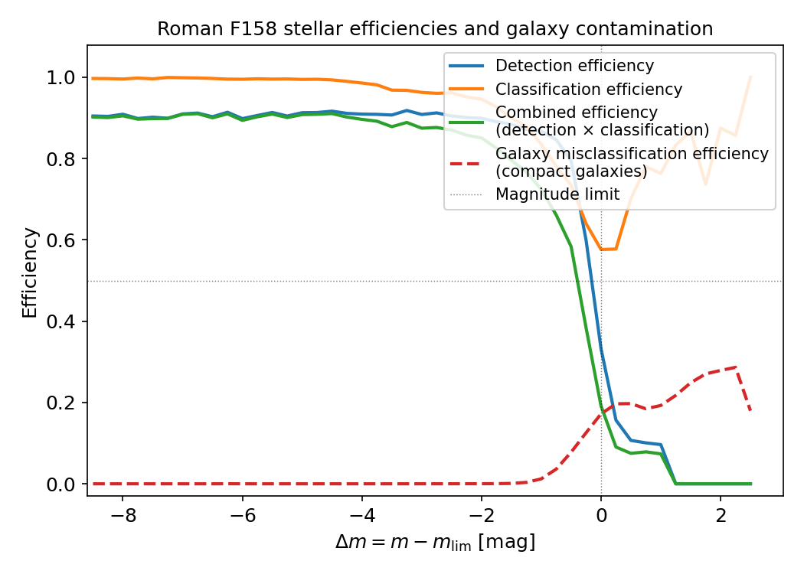
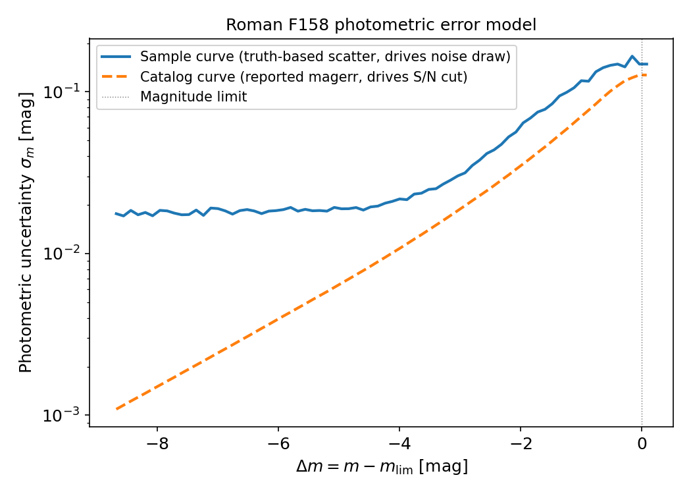
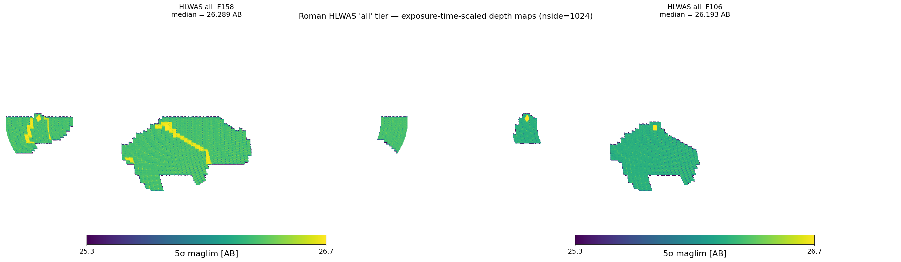

# Roman

**Roman** is supported by **StreamObs**.

## Available releases

| Release | Description |
|---|---|
| `dc2` | Roman–Rubin DC2 synthetic survey ([Troxel et al. 2023](https://arxiv.org/abs/2209.06829)); ~20 deg² at full HLIS reference depth |
| `hlwas_wide` | Real HLWAS Wide-tier footprint (~3372 deg²); F158 maglim from exposure-time scaling |
| `hlwas_medium` | Real HLWAS Medium-tier footprint (~2882 deg²); same exposure-scaled depth recipe |
| `hlwas_all` | All HLWAS tiers stacked (wide + medium + deep + ultra-deep, ~5878 deg²) |

The DC2 release is the calibration reference for all completeness and photometric-error
products. The HLWAS tier maps reuse the DC2-derived tables and apply them via the
shared $\Delta m = m - m_{\rm lim}$ convention; see {doc}`../roman_hlwas` for how
the tiers are defined and how the depth maps are built.

## Roman Survey Files

More information about the Roman DC2 simulations and the HLWAS tiers can be found
in the reference data sheets: {doc}`../roman_dc2` (DC2) and {doc}`../roman_hlwas`
(HLWAS). The methodology for deriving all selection-function products is documented
in {doc}`../selection_function_methodology`.

### The simulated survey

All selection-function quantities are measured from the Roman–Rubin DC2 synthetic
survey of [Troxel et al. (2023)](https://arxiv.org/abs/2209.06829): ~20 deg² of
image-level simulations of the Roman High Latitude Imaging Survey reference design
at full depth, reaching a 5σ point-source depth of ~26.9 AB in the F106/F129/F158
bands and 26.2 AB in F184. Stars are drawn from a Galfast Milky Way model and
galaxies from the cosmoDC2 extragalactic catalog. Object detection and photometry
are performed with SExtractor on a median coadd detection image, with forced
photometry per band over 1039 coadd tiles; the recommended catalog-level selection
of S/N > 5 in the detection image is applied on top.

The matched detection→truth catalog links every detected source to its truth
counterpart (1″ positional match, `flags == 0` + true-S/N > 5 in F158 selection),
enabling direct characterisation of photometric uncertainties, detection
efficiencies, and stellar classification performance. For detailed construction
steps see {doc}`../roman_dc2`.

### Stellar completeness and classification

The stellar selection function uses a single-band **F158 size-envelope classifier**
that separates point sources from resolved objects in the F158 half-light-radius vs.
magnitude plane. Stars that pass the S/N > 5 gate *and* fall within the size envelope
are counted as classified detections. Full details of the size-envelope boundaries and
the freeze magnitude are given in {doc}`../selection_function_methodology`.

The data file `roman_stellar_efficiency_cutf158.csv` provides, as a function of
$\Delta m_j = m_j - m_{{\rm lim},j}$:

- **`detection_eff`** — fraction of true stars with a clean true-S/N > 5 detection,
  against the full truth-star denominator (the S/N > 5 cut is baked in *once* here);
- **`classification_eff`** — fraction of those detected stars classified as point
  sources by the F158 size envelope;
- **`classification_detection_eff`** — their product, the **combined efficiency**
  used by StreamObs to probabilistically determine whether an injected star is observed.

The combined efficiency is the single curve that StreamObs applies; it encodes both
the detection step and the morphological classification step in the shared
$\Delta m$ convention, so the S/N > 5 cut is never re-applied independently.

Compact galaxies (true ${\rm size\_true} < 0.3\ {\rm arcsec}$) can be misclassified
as point sources by the size-envelope classifier, producing a contaminant population
for stellar-stream analyses. The galaxy contamination curve is stored in
`roman_galaxy_misclass_cutf158.csv` as `missclassification_eff` vs $\Delta m$.
The compact-galaxy size used to select the sample is an **interim measured-Roman
proxy** (`SIZE_SOURCE = measured_roman`; the cosmoDC2 true-size upgrade is pending).



*Detection efficiency, stellar classification efficiency, combined stellar efficiency,
and galaxy contamination efficiency as a function of distance to the local F158
magnitude limit $\Delta m = m - m_{\rm lim}$. The bright cut at $\Delta m = -8.7$
(saturation) removes rows where flux non-linearity affects the size measurement.*


### Photometric errors

The reported SExtractor `magerr_auto` underestimates the truth-based scatter of
$(m_{\rm obs} - m_{\rm true})$ by a flat factor of approximately 2 in all bands
(underestimated correlated coadd noise). StreamObs therefore uses a **two-curve
model**, both parameterised as a function of

$$
\Delta m_j = m_j - m_{{\rm lim},j}.
$$

- **Sample curve** (`roman_photoerror_f158.csv`): truth-based scatter of
  $(m_{\rm obs} - m_{\rm true})$; drives the per-source noise draw.
- **Catalog curve** (`roman_photoerror_f158_catalog.csv`): median reported
  `magerr_auto`; drives the S/N cut (which uses the reported uncertainty, not
  the truth scatter).

Both curves are stored as `log_mag_err` (base-10 logarithm of magnitude uncertainty)
vs `delta_mag`. Photometry is on the AB system. A bright-end saturation cut removes
rows with $\Delta m < -8.7$; for brighter sources the scatter increases discontinuously
due to pixel saturation.



*Photometric uncertainty $\sigma_m$ as a function of distance to the local F158
magnitude limit for the sample (truth-based scatter, drives the noise draw) and
catalog (reported magerr, drives the S/N cut) curves. The factor-of-~2 separation
between the curves reflects the underestimated correlated coadd noise in the DC2
mock.*


### Survey depth

Depth maps describe the spatial variation of the Roman 5σ limiting magnitude
across the survey footprint. All maps are nside=1024 (RING) HEALPix; off-footprint
pixels are set to `hp.UNSEEN`.

**HLWAS tiers (`release="hlwas_wide"`, `"hlwas_medium"`, `"hlwas_all"`):**
Exposure-time-scaled quasi-depth maps anchored to the DC2 F158 truth-anchored
reference depth so all tiers share the $\Delta m$ convention of the DC2 tables.
For the "all" tier (wide + medium + deep + ultra-deep, ~5878 deg²) the F158
median is 26.289 AB and the F106 median is 26.194 AB (both anchored via the
exposure-ratio recipe; see {doc}`../roman_hlwas` for the full recipe and
per-tier map medians).



*All-sky Mollweide view of the HLWAS "all" tier (wide + medium + deep + ultra-deep)
exposure-time-scaled depth maps in F158 (left, median 26.289 AB) and F106 (right,
median 26.194 AB), both anchored to the DC2 truth-anchored S/N = 5 reference
(nside = 1024). Off-footprint pixels are shown in white.*

**DC2 (`release="dc2"`):** Per-band, nside=1024 (RING) HEALPix maps built via
the desqr recipe and then **truth-anchored** — the median is shifted to the S/N = 5
magnitude of the truth-based scatter. Truth-anchored DC2 F158 median: 26.38 AB
(covering RA 51–56, Dec −42 to −38, ~20 deg²). The DC2 maps serve as the
calibration anchor for all HLWAS tier depth maps.


*Truth-anchored S/N = 5 maglim maps over the DC2 calibration footprint in F106,
F129, and F158 (nside = 1024). F184 is excluded from the selection-function
products (see Caveats).*


### Extinction coefficients

Dust extinction is modeled using the Schlegel et al. (1998) reddening maps.

The adopted extinction coefficients are the official STScI values from
Roman-STScI-000825 (Sharma, Table 3), bandpass-integrated with synphot for a
solar-parameter Phoenix spectrum:

| Filter | $A_{\rm band}\ /\ E(B-V)$ |
|--------|---------------------------|
| F106   | 1.1495                    |
| F129   | 0.8497                    |
| F158   | 0.6140                    |

These values are used to compute

$$
A_j = R_j\, E(B-V),
$$

and are applied consistently when generating observed magnitudes. The band ratios
have been independently validated to ~1% against the DC2 truth dereddening
corrections.


### Using the survey in streamobs

Configured by `config/surveys/roman_{release}.yaml`, data in
`data/surveys/roman_{release}/`:

```python
from streamobs.surveys import SurveyFactory

survey = SurveyFactory.create_survey(
    "roman",
    release="dc2"
)

maglim = survey.get_maglim("F158", pixel=pix)

completeness = survey.get_completeness(
    "F158",
    mag,
    maglim
)

photo_error = survey.get_photo_error(
    "F158",
    mag,
    maglim
)
```

For the HLWAS tiers, substitute `release="hlwas_wide"`, `release="hlwas_medium"`,
or `release="hlwas_all"`. The completeness and photo-error tables are shared across
all releases; only the depth map differs per tier.


### Caveats

* Selection functions are derived from the ~20 deg² DC2 calibration region and
  extrapolated across the full footprint — including the HLWAS (~3400–5900 deg²) —
  through the local magnitude-limit parameterisation $\Delta m = m - m_{\rm lim}$.
* The size-envelope classifier is **single-band F158**; morphological performance
  in other bands is not separately characterised.
* The galaxy misclassification curve uses an **interim measured-Roman proxy** for
  compact-galaxy size (`SIZE_SOURCE = measured_roman`); the cosmoDC2 true-size
  upgrade is pending.
* F184 is excluded from the selection-function products: it is deep-tier-only in
  the community-defined HLWAS and has an unresolved chromatic calibration issue in
  the DC2 mock.
* DC2 simulations correspond to the HLIS reference design depth (~26.9 AB in F158);
  HLWAS-wide behaviour (~26.3 AB) is obtained by translation in $\Delta m$, relying
  on the universality of the $\Delta m$ parameterisation.
* The `hlwas_all` map includes deep/ultra-deep pixels where the DC2-derived
  selection function may be unreliable (see {doc}`../roman_hlwas`).
