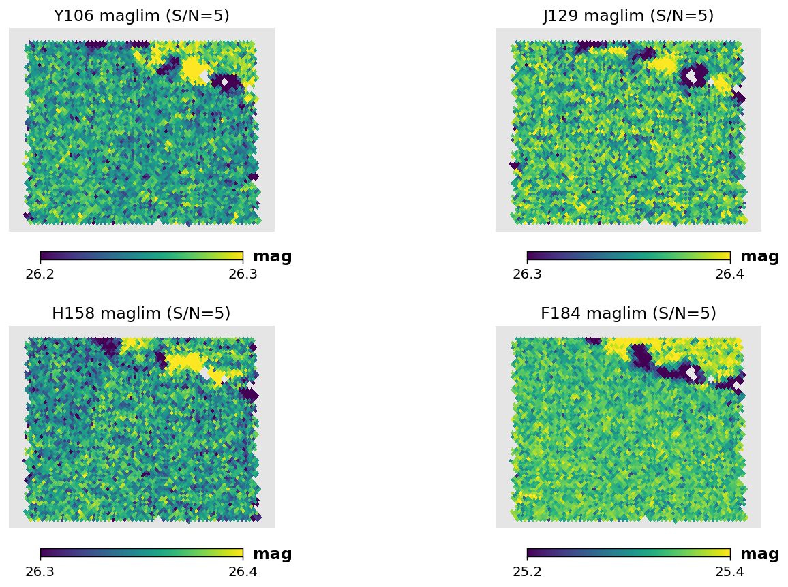
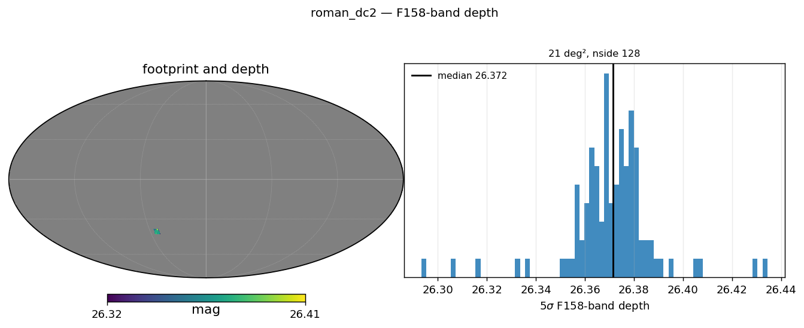
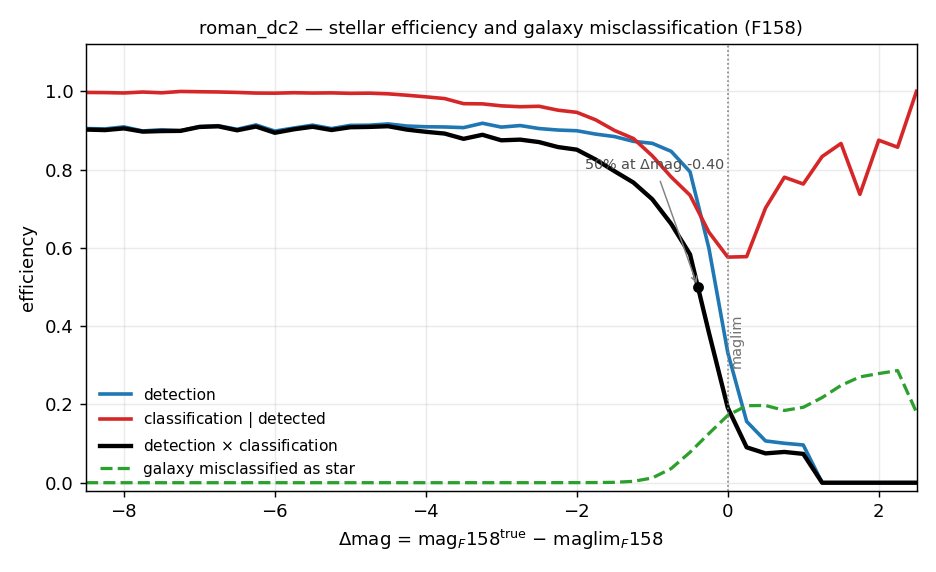
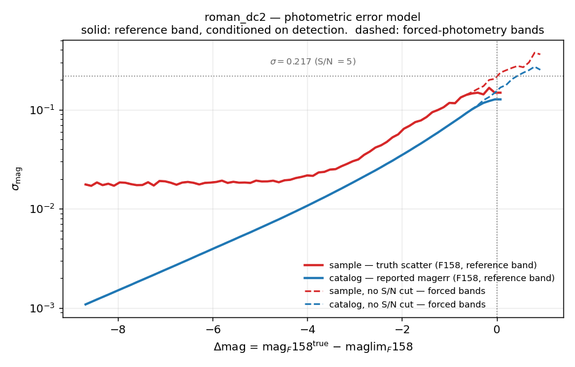

# Roman

**Roman** is supported by **StreamObs**.

## Available releases

| release | bands | footprint | reference band | median reference-band depth |
|---|---|---|---|---|
| `roman/dc2` | F106, F129, F158 | ~16.4 deg² (Roman–Rubin DC2, RA 51–56, Dec −42 to −38) | F158 | 26.375 AB |
| `roman/hlwas_wide` | F158 | 3,372 deg² | F158 | 26.284 AB |
| `roman/hlwas_medium` | F158 | 2,882 deg² | F158 | 26.289 AB |
| `roman/hlwas_all` | F106, F158 | 5,878 deg² (F158); F106 covers only 2,882 deg² within this footprint (see *Depth and bands*) | F158 | 26.289 AB |

`roman/dc2` is the calibration reference ([Troxel et al. 2023](https://arxiv.org/abs/2209.06829))
for all completeness and photometric-error products. The HLWAS tier maps
reuse the DC2-derived tables and apply them via the shared
$\Delta m = m - m_{\rm lim}$ convention; see {doc}`../roman_hlwas` for how the
tiers are defined and how the depth maps are built, and {doc}`../roman_dc2`
for the DC2 reference data sheet.

## Products

| File(s) | Contents | Drives |
|---|---|---|
| `roman_dc2_maglim_{f106,f129,f158,f184}_nside 128.fits.gz` (`dc2`); `roman_hlwas_wide_maglim_f158_nside 128.fits.gz`; `roman_hlwas_medium_maglim_f158_nside 128.fits.gz`; `roman_hlwas_all_maglim_{f106,f158}_nside 128.fits.gz` | HEALPix 5σ point-source depth map, one file per band | `Survey.get_maglim(band, pixel)` |
| `roman_stellar_efficiency_cutf158.csv` | `mag_f158, delta_mag, detection_eff, classification_eff, classification_detection_eff` | `Survey.get_completeness(band, mag, maglim)` — detection + star-classification probability |
| `roman_photoerror_f158.csv` (**sample**) / `roman_photoerror_f158_catalog.csv` (**catalog**) | `delta_mag, log_mag_err` | reference-band (F158) magnitude noise draw / reported-error S/N cut |
| `roman_photoerror_f158_nocut.csv` / `roman_photoerror_f158_catalog_nocut.csv` | same columns, no S/N selection applied | every other band (forced photometry) |
| `roman_galaxy_misclass_cutf158.csv` | `delta_mag, missclassification_eff` | compact-galaxy contamination rate (informational; not yet consumed by the injector) |
| `ebv_sfd98_lowres_nside_512_ring_equatorial.fits` | E(B−V) HEALPix map, shared across releases | `Survey.get_extinction(band, pixel)` |

The completeness, misclassification, and photo-error tables above are shared
across **all four releases**; only the depth map differs per release/tier.
See *Creation* for how that sharing is implemented.

## Depth and bands

All maps are **nside 128** (RING) HEALPix; off-footprint pixels are set to
`hp.UNSEEN`.

**`roman/dc2`** — per-band maglim maps built via the desqr recipe and
**truth-anchored** (the median is shifted to the S/N = 5 magnitude of the
truth-based scatter). Medians: F106 = 26.279, F129 = 26.375, F158 = 26.375,
F184 = 25.347 AB, all over the ~16.4 deg² DC2 footprint. F184 has a map but is
**not** one of the configured selection-function bands (see Caveats). The DC2
maps serve as the calibration anchor for all HLWAS tier depth maps.



*Truth-anchored S/N = 5 maglim maps over the DC2 calibration footprint in
F106, F129, and F158 (nside 128). F184 is excluded from the
selection-function products (see Caveats).*

**HLWAS tiers** (`hlwas_wide`, `hlwas_medium`, `hlwas_all`) — exposure-time-scaled
quasi-depth maps anchored to the DC2 F158 truth-anchored reference depth, so
all tiers share the $\Delta m$ convention of the DC2 tables. F158 medians:
wide 26.284 over 3,372 deg², medium 26.289 over 2,882 deg², all 26.289 over
5,878 deg². The `hlwas_all` release additionally ships an F106 map, but it
only covers 2,882 deg² — the medium-tier footprint, not the full 5,878 deg²
F158 footprint — so F106 must not be queried outside that region for this
release; its median there is 26.194.



*All-sky Mollweide view of the HLWAS "all" tier (wide + medium + deep +
ultra-deep) exposure-time-scaled depth maps in F158 (left, median 26.289 AB)
and F106 (right, median 26.194 AB), both anchored to the DC2 truth-anchored
S/N = 5 reference (nside 128). Off-footprint pixels are shown in white.*

**Band coverage.** The reference band is **F158** in every release.
`roman/dc2` additionally supports F106 and F129 (bands configured:
`[F106, F129, F158]`). The HLWAS tiers support only F158, except
`hlwas_all`, which also ships the restricted-footprint F106 map above.
F184 is excluded from every release's configured bands (see Caveats).

## Photometric errors

The reference band is **F158** (`completeness_band: F158`).
`Survey.get_photo_error` carries two pairs of `delta_mag, log_mag_err` curves
and picks between them automatically:

- For the **reference band (F158)**: the **sample** curve
  (`roman_photoerror_f158.csv`, truth-based scatter of obs − true — drives the
  per-source noise draw) and the **catalog** curve
  (`roman_photoerror_f158_catalog.csv`, median reported SExtractor
  `magerr_auto` — drives the S/N cut). Both are measured on the S/N > 5
  *detected* population, because that is the population the reference-band
  curve is applied to.
- For **every other band** (F106, F129 — forced photometry from the F158
  detection): the `_nocut` pair (`roman_photoerror_f158_nocut.csv`,
  `roman_photoerror_f158_catalog_nocut.csv`), measured with **no** S/N
  selection, because a non-reference band's photometry is not conditioned on
  detection in that band. Using the detected-population curve there would
  understate the errors.

Call `survey.get_photo_error(band, mag, maglim, kind="sample"|"catalog")`;
StreamObs resolves the correct pair from `band` and **raises `ValueError`**
if the `_nocut` curve a non-reference band needs is not loaded, rather than
silently falling back to the reference-band curve.

Photometry is on the AB system. `get_photo_error` returns `NaN` for
magnitudes brighter than the configured saturation limit (17.0 mag) — the
curves do not model the saturation regime. See
*Photometric-error derivation* for how the
curves were built and why the two-curve model is needed at all.

## Extinction coefficients

Dust extinction is modeled using the Schlegel et al. (1998) reddening maps.

The adopted extinction coefficients are the official STScI values from
Roman-STScI-000825 (Sharma, Table 3), bandpass-integrated with synphot for a
solar-parameter Phoenix spectrum:

| Filter | $A_{\rm band}\ /\ E(B-V)$ |
|--------|---------------------------|
| F106   | 1.1495                    |
| F129   | 0.8497                    |
| F158   | 0.6140                    |

These values are used to compute

$$
A_j = R_j\, E(B-V),
$$

and are applied consistently when generating observed magnitudes. The band
ratios have been independently validated to ~1% against the DC2 truth
dereddening corrections.

## Using it in streamobs

Configured by `config/surveys/roman_{release}.yaml`, data in
`data/surveys/roman_{release}/`:

```python
from streamobs.surveys import SurveyFactory

survey = SurveyFactory.create_survey(
    "roman",
    release="dc2"
)

maglim = survey.get_maglim("F158", pixel=pix)

completeness = survey.get_completeness(
    "F158",
    mag,
    maglim
)

photo_error = survey.get_photo_error(
    "F158",
    mag,
    maglim
)
```

For the HLWAS tiers, substitute `release="hlwas_wide"`, `release="hlwas_medium"`,
or `release="hlwas_all"`. The completeness and photo-error tables are shared
across all releases; only the depth map differs per tier.

## Caveats

* Selection functions are derived from the ~20 deg² DC2 calibration region and
  extrapolated across the full footprint — including the HLWAS (~3,400–5,900 deg²) —
  through the local magnitude-limit parameterisation $\Delta m = m - m_{\rm lim}$.
* The size-envelope classifier is **single-band F158**; morphological
  performance in other bands is not separately characterised.
* F184 is excluded from the selection-function products: it is deep-tier-only
  in the community-defined HLWAS and has an unresolved chromatic calibration
  issue in the DC2 mock.
* DC2 simulations correspond to the HLIS reference design depth (~26.9 AB in
  F158); HLWAS-wide behaviour (~26.3 AB) is obtained by translation in
  $\Delta m$, relying on the universality of the $\Delta m$ parameterisation.
* The `hlwas_all` map includes deep/ultra-deep pixels where the DC2-derived
  selection function may be unreliable (see {doc}`../roman_hlwas`).
* `get_photo_error` returns `NaN` for magnitudes brighter than the configured
  saturation limit (17.0 mag) — the curves do not model the saturation
  regime.

## Creation

The methodology for deriving all selection-function products is documented in
{doc}`../selection_function_methodology`.

### How the survey was simulated

All selection-function quantities are measured from the Roman–Rubin DC2
synthetic survey of [Troxel et al. (2023)](https://arxiv.org/abs/2209.06829):
~20 deg² of image-level simulations of the Roman High Latitude Imaging Survey
reference design at full depth, reaching a 5σ point-source depth of ~26.9 AB
in the F106/F129/F158 bands and 26.2 AB in F184. Stars are drawn from a
Galfast Milky Way model and galaxies from the cosmoDC2 extragalactic catalog.
Object detection and photometry are performed with SExtractor on a median
coadd detection image, with forced photometry per band over 1039 coadd
tiles; the recommended catalog-level selection of S/N > 5 in the detection
image is applied on top.

The matched detection→truth catalog links every detected source to its truth
counterpart (1″ positional match, `flags == 0` + true-S/N > 5 in F158
selection), enabling direct characterisation of photometric uncertainties,
detection efficiencies, and stellar classification performance. For detailed
construction steps see {doc}`../roman_dc2`.

The HLWAS tiers (`hlwas_wide`, `hlwas_medium`, `hlwas_all`) reuse the
DC2-derived completeness, misclassification, and photo-error tables unchanged
and pair them with their own exposure-time-scaled depth maps
(`scripts/roman/build_hlwas_maglim_maps.py`); only `roman/dc2` itself is
independently derived end-to-end
(`scripts/roman/create_streamobs_files_hlwas.py`).

### Depth-map derivation

Depth maps describe the spatial variation of the Roman 5σ limiting magnitude
across the survey footprint.

**DC2:** built via the desqr recipe and then **truth-anchored** — the median
is shifted to the S/N = 5 magnitude of the truth-based scatter of
(obs − true). Truth-anchored DC2 F158 median: 26.375 AB.

**HLWAS tiers** (Option B — DC2 truth-anchored, exposure-ratio scaling):

$$
{\rm depth(pix)} = {\rm DC2\_REF\_DEPTH} + 1.25 \cdot \log_{10}\!\left(\frac{t({\rm pix})}{{\rm DC2\_REF\_EXPTIME}}\right)
$$

with `DC2_REF_DEPTH` = 26.375 AB (F158) / 26.279 AB (F106) — the median of the
corresponding DC2 truth-anchored maglim map — and `DC2_REF_EXPTIME` = 770.0 s
(the DC2 HLIS reference per-pixel exposure = 5.5 dithers × 140 s/exposure,
Troxel et al. 2023 Sec. 3.1); `t(pix)` is the per-pixel exposure time from the
tier's `.hsp` exposure-time map, used directly. F158 wide ≈ medium (single-band)
because medium's extra HLWAS depth vs. wide is in additional bands, not F158
alone; both tiers have the same F158-only median exposure time (~645 s) and
the same DC2 reference anchor. Generated by
`scripts/roman/build_hlwas_maglim_maps.py`.

### Star/galaxy classification

The stellar selection function uses a single-band **F158 size-envelope
classifier** that separates point sources from resolved objects in the F158
half-light-radius vs. magnitude plane. Stars that pass the S/N > 5 gate *and*
fall within the size envelope are counted as classified detections. Full
details of the size-envelope boundaries and the freeze magnitude are given in
{doc}`../selection_function_methodology`.

The data file `roman_stellar_efficiency_cutf158.csv` provides, as a function
of $\Delta m_j = m_j - m_{{\rm lim},j}$:

- **`detection_eff`** — fraction of true stars with a clean true-S/N > 5
  detection, against the full truth-star denominator (the S/N > 5 cut is
  baked in *once* here);
- **`classification_eff`** — fraction of those detected stars classified as
  point sources by the F158 size envelope;
- **`classification_detection_eff`** — their product, the **combined
  efficiency** used by StreamObs to probabilistically determine whether an
  injected star is observed.

The combined efficiency is the single curve that StreamObs applies; it
encodes both the detection step and the morphological classification step in
the shared $\Delta m$ convention, so the S/N > 5 cut is never re-applied
independently.

Compact galaxies (true ${\rm size\_true} < 0.3\ {\rm arcsec}$) can be
misclassified as point sources by the size-envelope classifier, producing a
contaminant population for stellar-stream analyses. The galaxy contamination
curve is stored in `roman_galaxy_misclass_cutf158.csv` as
`missclassification_eff` vs $\Delta m$. The compact-galaxy size used to select
the sample is an **interim measured-Roman proxy**
(`SIZE_SOURCE = measured_roman`; the cosmoDC2 true-size upgrade is pending).



*Detection efficiency, stellar classification efficiency, combined stellar
efficiency, and galaxy contamination efficiency as a function of distance to
the local F158 magnitude limit $\Delta m = m - m_{\rm lim}$. The bright cut at
$\Delta m = -8.7$ (saturation) removes rows where flux non-linearity affects
the size measurement.*

### Photometric-error derivation

The reported SExtractor `magerr_auto` underestimates the truth-based scatter
of $(m_{\rm obs} - m_{\rm true})$ by a flat factor of approximately 2 in all
bands (underestimated correlated coadd noise). StreamObs therefore uses the
**two-curve model** described in *Photometric errors*
above: the **sample** curve is the truth-based scatter, the **catalog** curve
is the median reported `magerr_auto`. Both curves are stored as
`log_mag_err` (base-10 logarithm of magnitude uncertainty) vs `delta_mag`. A
bright-end saturation cut removes rows with $\Delta m < -8.7$; for brighter
sources the scatter increases discontinuously due to pixel saturation.



*Photometric uncertainty $\sigma_m$ as a function of distance to the local
F158 magnitude limit for the sample (truth-based scatter, drives the noise
draw) and catalog (reported magerr, drives the S/N cut) curves. The
factor-of-~2 separation between the curves reflects the underestimated
correlated coadd noise in the DC2 mock.*

### Derivation-level limitations

* The galaxy misclassification curve uses an **interim measured-Roman proxy**
  for compact-galaxy size (`SIZE_SOURCE = measured_roman`); the cosmoDC2
  true-size upgrade is pending.
